# 2.5-month-of-microsoft-azure-machine-learning-challenge
This repo contains all the information related to Machine Learning for Microsoft Azure Scholarship Program of Phase-I and if selected then of Phase-II as well.


## Day 40: August 22, 2020. #50daysofudacity 
- My current progress is:\
  **1. Introduction to Machine Learning on Azure** (Progress 93%)
    - **Lesson 6. Managed Services for Machine Learning** (Progress 75%)
		- **Lab: Explore Experiments and Runs**
		- **Walkthrough: Explore Experiments and Runs**
		- **Advanced Modeling**
		- **Operationalizing Models**
			

I will send good vibes to awesome folks who are doing great @nileshnegi @Varsha Kesavan @Ashika @Vinay @Varez.W @Snehal Lokesh @Ravi @Jahnavi Jonnalagadda @Vaidehi @Fatima @Tugce @Vanessa Correia @Anok Kumar @Jerry Liao @Iwan Saputra @Godspower Onyenanu @Karthik R @Godspower Onyenanu @Oriji Sandra O. @Jorge @Anela Karamustafic @Sudarshni Sivashankar @Soumi7 @Pasupuleti Chandanato @Kenneth Pham @Seyide Hunyinbo @Shuvro Pal @Vamsi @rafayel @Mike McK @Sebastian Rodriguez @Chris M @Tahreem Arif @Hung @Sabyh @saikat pandit @Zahra Nabila Izdihar and @Kirtika Jaiswal

I will encourage @Mukund and @Duygu to continue #50daysofudacity till completion of course.

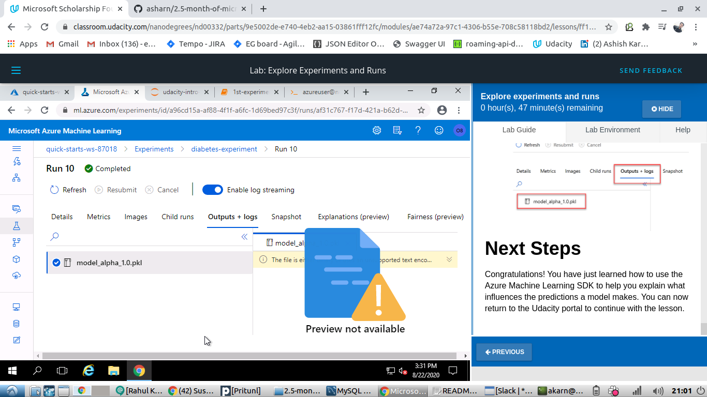
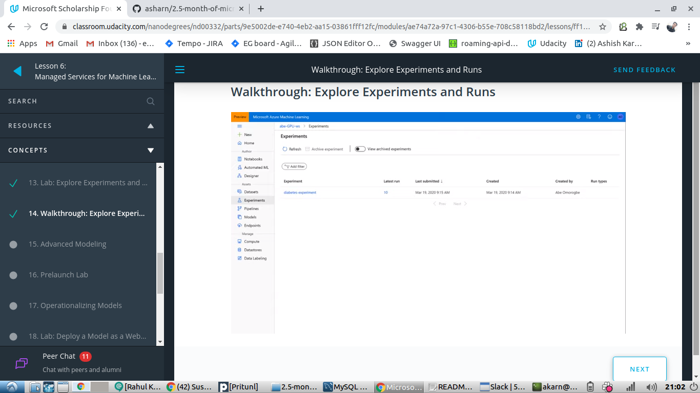
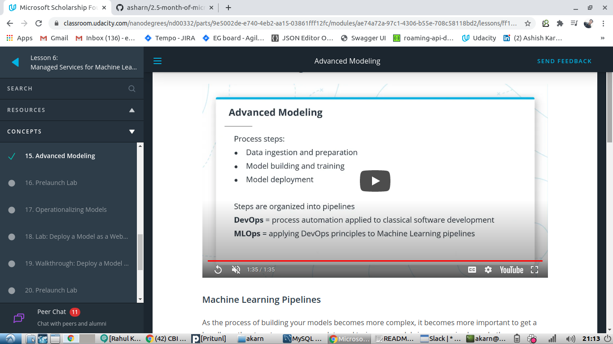
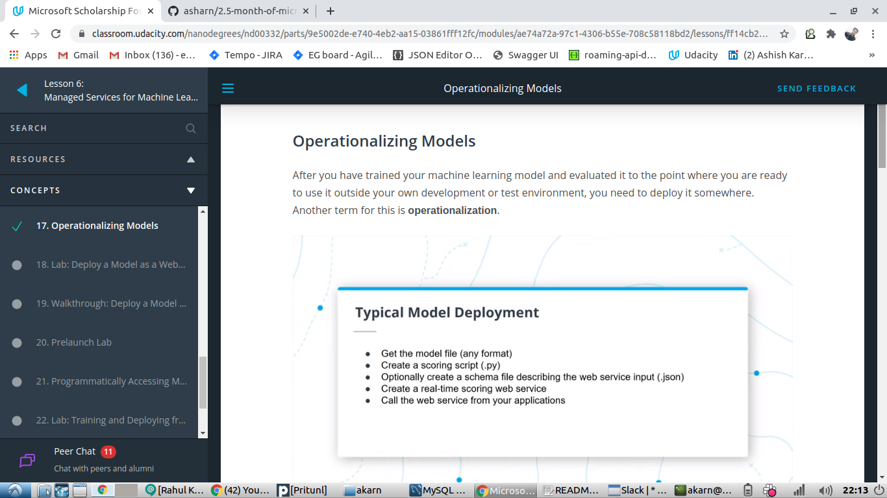


## Day 39: August 21, 2020. #50daysofudacity 
- My current progress is:\
  **1. Introduction to Machine Learning on Azure** (Progress 90%)
    - **Lesson 6. Managed Services for Machine Learning** (Progress 58%)
		- **Managed Notebook Environments**
		- **Lab: Managed Notebook Environments**
		- **Walkthrough: Managed Notebook Environments**
		- **Basic Modeling**
			

I will send good vibes to awesome folks who are doing great @Ashika @Vinay @Varez.W @Snehal Lokesh @Ravi @Jahnavi Jonnalagadda @Vaidehi @Fatima @Tugce @Vanessa Correia @Anok Kumar @Jerry Liao @Iwan Saputra @Godspower Onyenanu @Karthik R @Godspower Onyenanu @Oriji Sandra O. @Jorge @Anela Karamustafic @Sudarshni Sivashankar @Soumi7 @Pasupuleti Chandanato @Kenneth Pham @Seyide Hunyinbo @Shuvro Pal @Vamsi @rafayel @Mike McK @Sebastian Rodriguez @Chris M @Tahreem Arif @Hung @Sabyh @saikat pandit @Zahra Nabila Izdihar and @Kirtika Jaiswal

I will encourage @nileshnegi and @Varsha Kesavan to continue #50daysofudacity till completion of course.

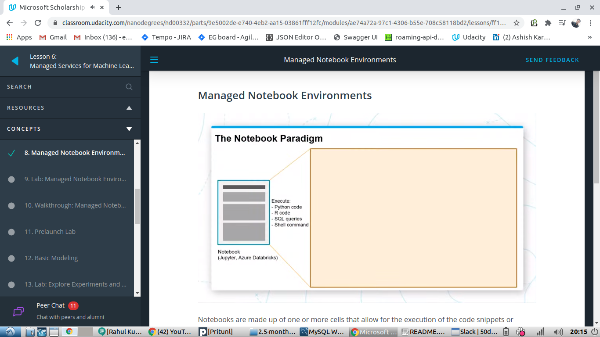
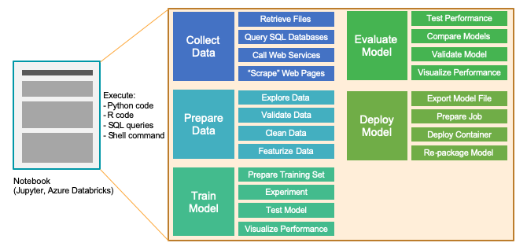
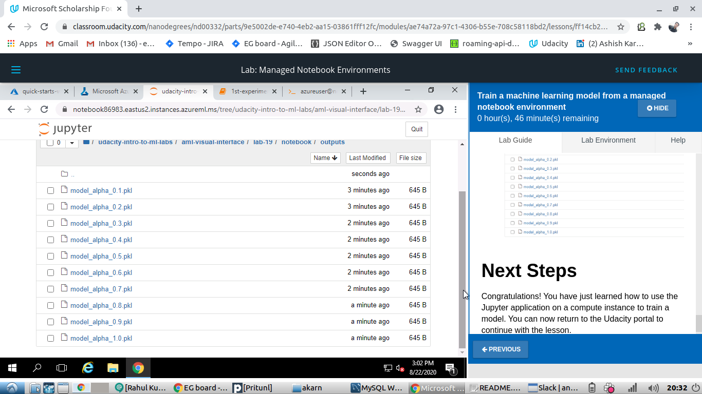
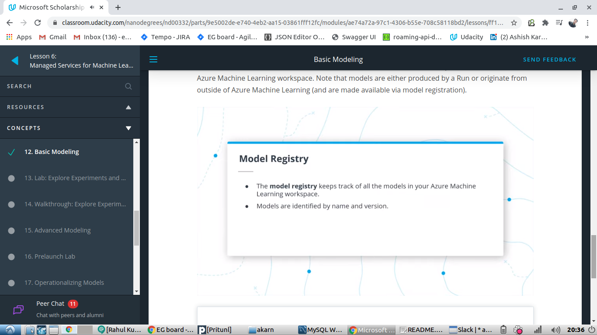


## Day 38: August 20, 2020. #50daysofudacity 
- My current progress is:\
  **1. Introduction to Machine Learning on Azure** (Progress 87%)
    - **Lesson 6. Managed Services for Machine Learning** (Progress 33%)
		- **Lab: Managing Compute**
		- **Walkthrough: Managing Compute**
			

I will send good vibes to awesome folks who are doing great @Ashika @Vinay @Varez.W @Snehal Lokesh @Ravi @Jahnavi Jonnalagadda @Vaidehi @Fatima @Tugce @Vanessa Correia @Anok Kumar @Jerry Liao @Iwan Saputra @Godspower Onyenanu @Karthik R @Godspower Onyenanu @Oriji Sandra O. @Jorge @Anela Karamustafic @Sudarshni Sivashankar @Soumi7 @Pasupuleti Chandanato @Kenneth Pham @Seyide Hunyinbo @Shuvro Pal @Vamsi @rafayel @Mike McK @Sebastian Rodriguez @Chris M @Tahreem Arif @Hung @Sabyh @saikat pandit @Zahra Nabila Izdihar and @Kirtika Jaiswal

I will encourage @Ashika and @Vinay to continue #50daysofudacity till completion of course.

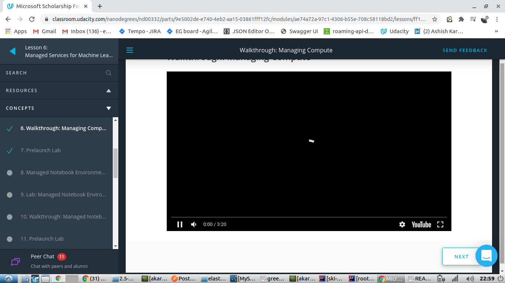
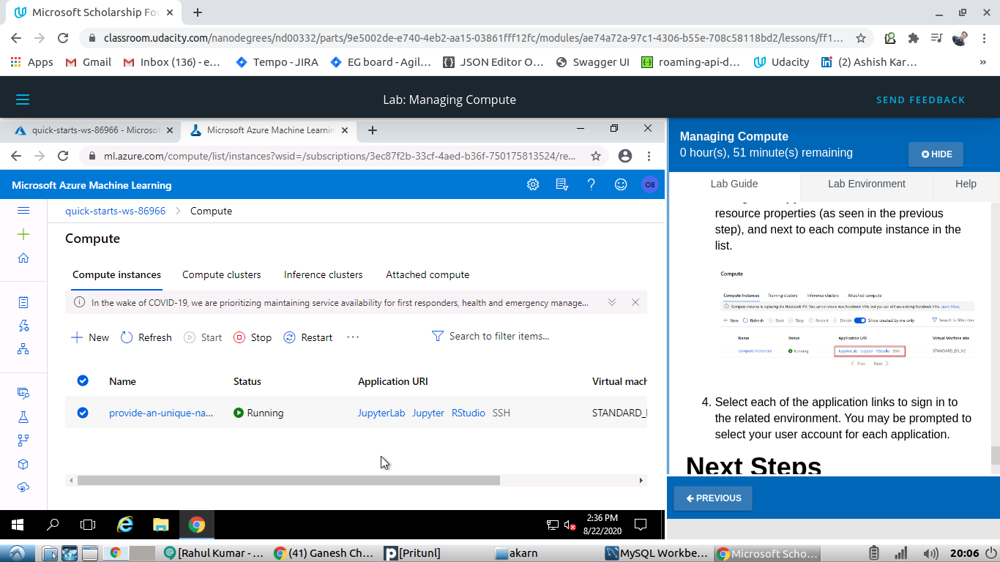


## Day 37: August 19, 2020. #50daysofudacity 
- My current progress is:\
  **1. Introduction to Machine Learning on Azure** (Progress 85%)
    - **Lesson 6. Managed Services for Machine Learning** (Progress 25%)
		- **Lesson Overview**
		- **Managed Services for Machine Learning**
		- **Prelaunch Lab**
		- **Compute Resourses**
			

I will send good vibes to awesome folks who are doing great @Varez.W @Snehal Lokesh @Ravi @Jahnavi Jonnalagadda @Vaidehi @Fatima @Tugce @Vanessa Correia @Anok Kumar @Jerry Liao @Iwan Saputra @Godspower Onyenanu @Karthik R @Godspower Onyenanu @Oriji Sandra O. @Jorge @Anela Karamustafic @Sudarshni Sivashankar @Soumi7 @Pasupuleti Chandanato @Kenneth Pham @Seyide Hunyinbo @Shuvro Pal @Vamsi @rafayel @Mike McK @Sebastian Rodriguez @Chris M @Tahreem Arif @Hung @Sabyh @saikat pandit @Zahra Nabila Izdihar and @Kirtika Jaiswal

I will encourage @Ashika and @Vinay to continue #50daysofudacity till completion of course.

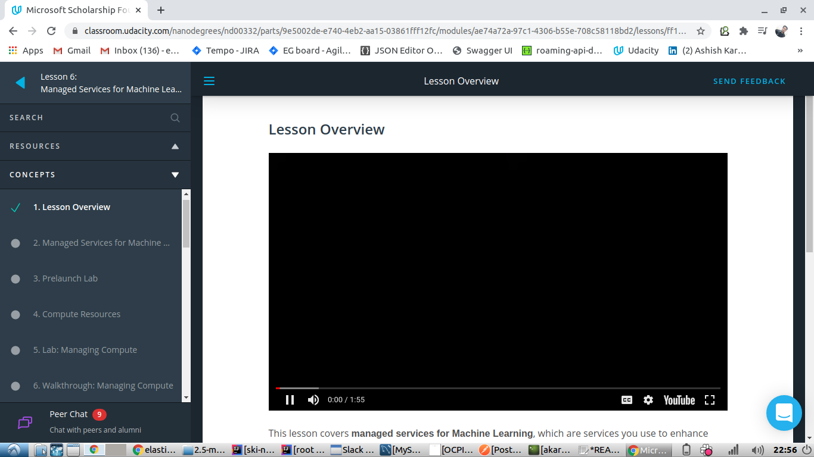
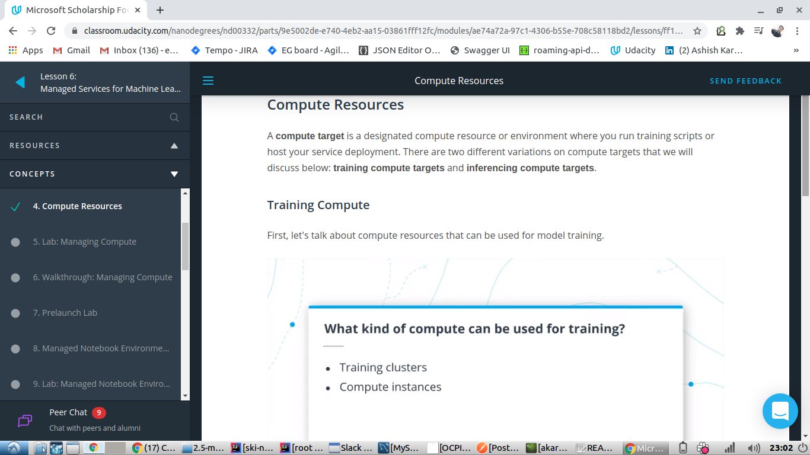


## Day 36: August 18, 2020. #50daysofudacity 
- My current progress is:\
  **1. Introduction to Machine Learning on Azure** (Progress 83%)
    - **Lesson 5. Applications of Machine Learning** (Progress 100%)
		- **Forecasting**
		- **Lab: Forecasting**
		- **Walkthrough: Forecasting**
		- **Lesson Summary**
			

I will send good vibes to awesome folks who are doing great  @Ravi @Jahnavi Jonnalagadda @Vaidehi @Fatima Correia @Tugce @Vanessa Correia @Anok Kumar @Jerry Liao @Iwan Saputra @Godspower Onyenanu @Karthik R @Godspower Onyenanu @Oriji Sandra O. @Jorge @Anela Karamustafic @Sudarshni Sivashankar @Soumi7 @Pasupuleti Chandanato @Kenneth Pham @Seyide Hunyinbo @Shuvro Pal @Vamsi @rafayel @Mike McK @Sebastian Rodriguez @Chris M @Tahreem Arif @Hung @Sabyh @saikat pandit @Zahra Nabila Izdihar and @Kirtika Jaiswal

I will encourage @Varez.W and @Snehal Lokesh to continue #50daysofudacity till completion of course.

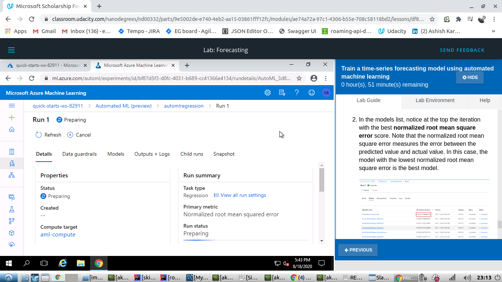
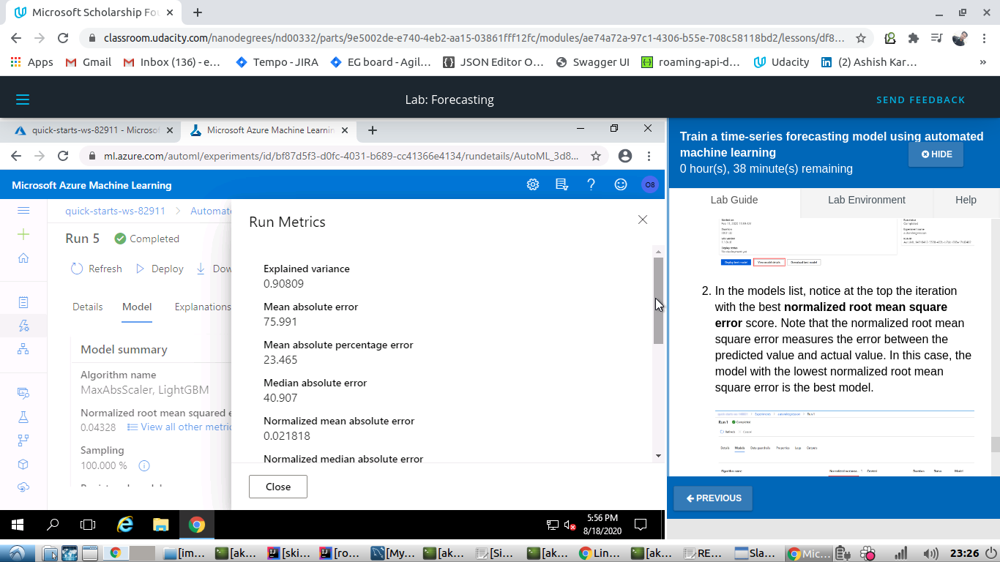
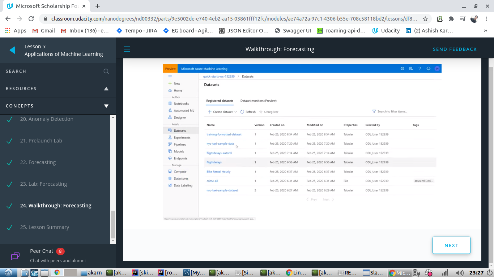


## Day 35: August 17, 2020. #50daysofudacity 
- My current progress is:\
  **1. Introduction to Machine Learning on Azure** (Progress 82%)
    - **Lesson 5. Applications of Machine Learning** (Progress 94%)
		- **Feature Learning**
		- **Applications of Feature Learning**
		- **Anomaly Detection**
			

I will send good vibes to awesome folks who are doing great  @Vaidehi @Fatima Correia @Tugce @Vanessa Correia @Anok Kumar @Jerry Liao @Iwan Saputra @Godspower Onyenanu @Karthik R @Godspower Onyenanu @Oriji Sandra O. @Jorge @Anela Karamustafic @Sudarshni Sivashankar @Soumi7 @Pasupuleti Chandanato @Kenneth Pham @Seyide Hunyinbo @Shuvro Pal @Vamsi @rafayel @Mike McK @Sebastian Rodriguez @Chris M @Tahreem Arif @Hung @Sabyh @saikat pandit @Zahra Nabila Izdihar and @Kirtika Jaiswal

I will encourage @Ravi and @Jahnavi Jonnalagadda to continue #50daysofudacity till completion of course.

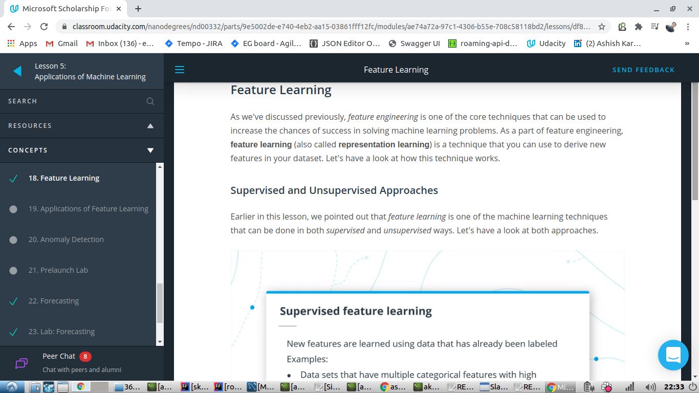
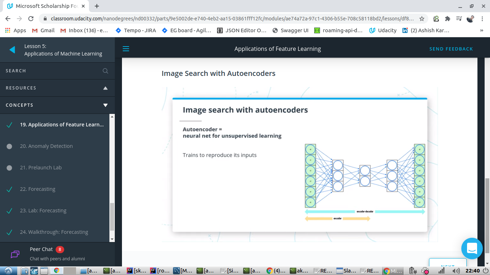
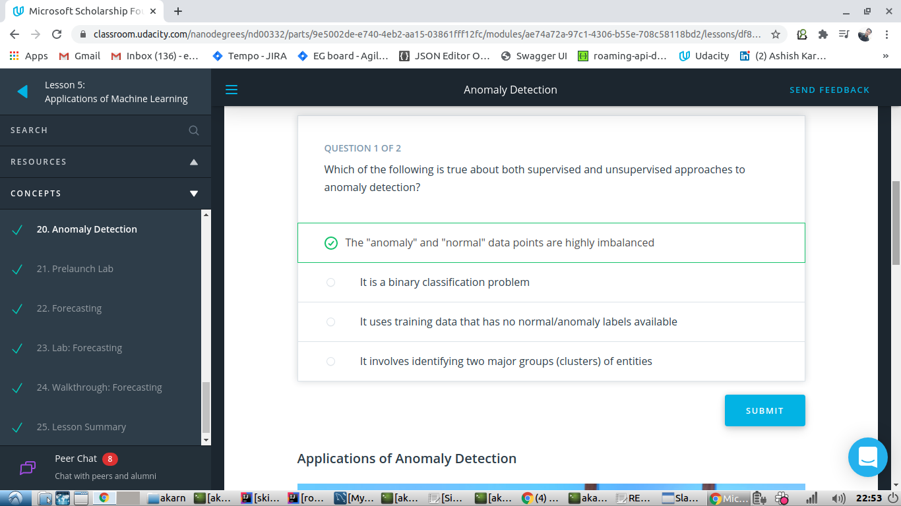


## Day 34: August 16, 2020. #50daysofudacity 
- My current progress is:\
  **1. Introduction to Machine Learning on Azure** (Progress 81%)
    - **Lesson 5. Applications of Machine Learning** (Progress 88%)
		- **Text Classification**
		- [**Term Frequency-Inverse Document Frequency (TF-IDF) vectorization**](https://en.wikipedia.org/wiki/Tf-idf)
		- **Similarity Learning**
		- **Train a Simple Recommender**
		- **Walkthrough: Train a Simple Recommender**
			

I will send good vibes to awesome folks who are doing great  @Vaidehi @Fatima Correia @Tugce @Vanessa Correia @Anok Kumar @Jerry Liao @Iwan Saputra @Godspower Onyenanu @Karthik R @Godspower Onyenanu @Oriji Sandra O. @Jorge @Anela Karamustafic @Sudarshni Sivashankar @Soumi7 @Pasupuleti Chandanato @Kenneth Pham @Seyide Hunyinbo @Shuvro Pal @Vamsi @rafayel @Mike McK @Sebastian Rodriguez @Chris M @Tahreem Arif @Hung @Sabyh @saikat pandit @Zahra Nabila Izdihar and @Kirtika Jaiswal

I will encourage @Vaidehi and @Fatima Correia to continue #50daysofudacity till completion of course.

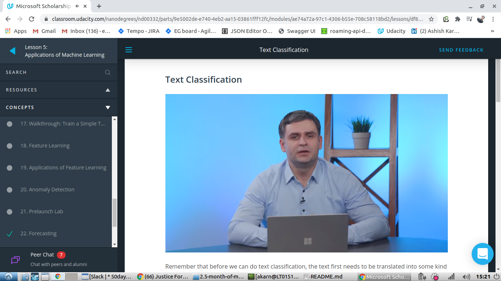
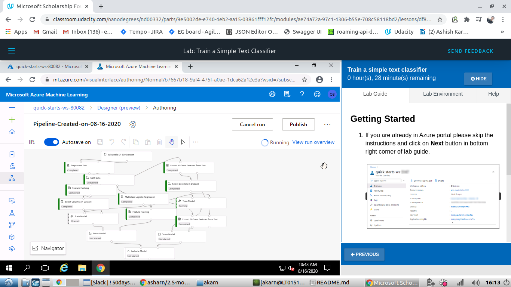
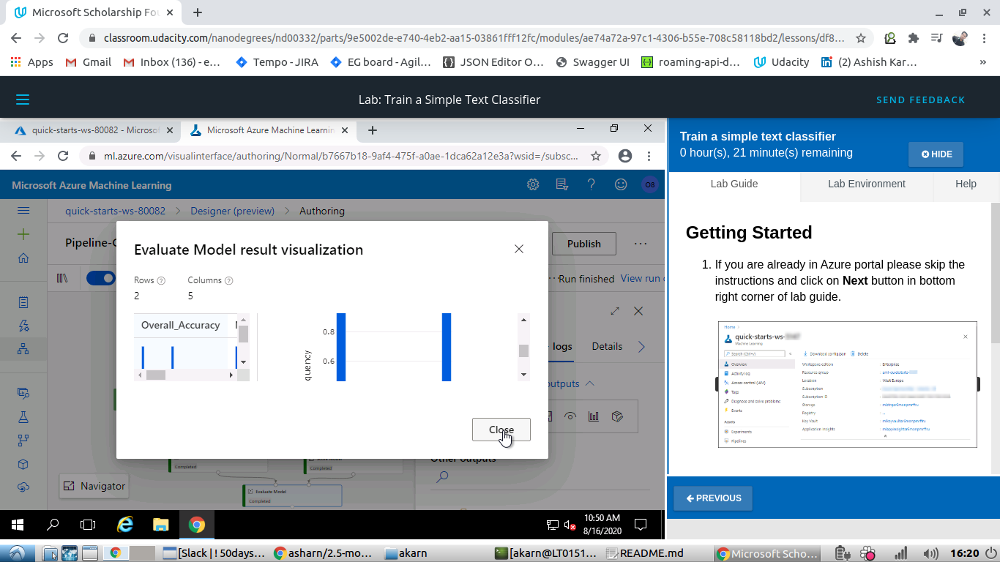
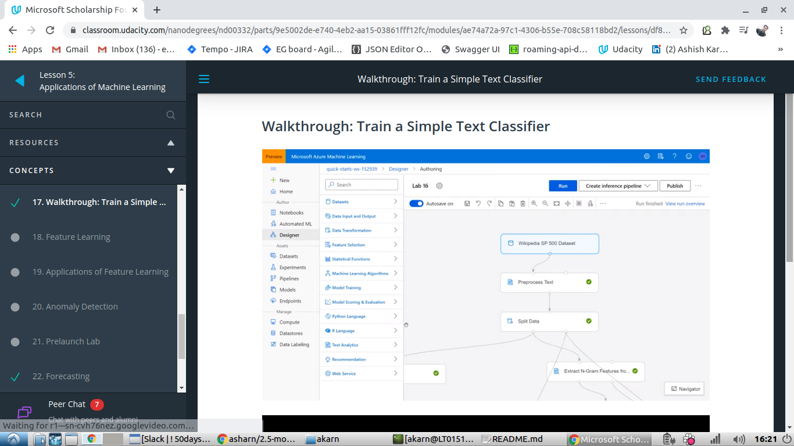

## Day 33: August 15, 2020. #50daysofudacity 
- My current progress is:\
  **1. Introduction to Machine Learning on Azure** (Progress 79%)
    - **Lesson 5. Applications of Machine Learning** (Progress 76%)
		- **Specialized Cases of Model Training**
			- Supervised learning
			- Unsupervised learning
			- Reinforcement learning
		- **Similarity Learning**
		- **Train a Simple Recommender**
		- **Walkthrough: Train a Simple Recommender**
			

I will send good vibes to awesome folks who are doing great  @Tugce @Vanessa Correia @Anok Kumar @Jerry Liao @Iwan Saputra @Godspower Onyenanu @Karthik R @Godspower Onyenanu @Oriji Sandra O. @Jorge @Anela Karamustafic @Sudarshni Sivashankar @Soumi7 @Pasupuleti Chandanato @Kenneth Pham @Seyide Hunyinbo @Shuvro Pal @Vamsi @rafayel @Mike McK @Sebastian Rodriguez @Chris M @Tahreem Arif @Hung @Sabyh @saikat pandit @Zahra Nabila Izdihar and @Kirtika Jaiswal

I will encourage @Vaidehi and @Fatima Correia to continue #50daysofudacity till completion of course.

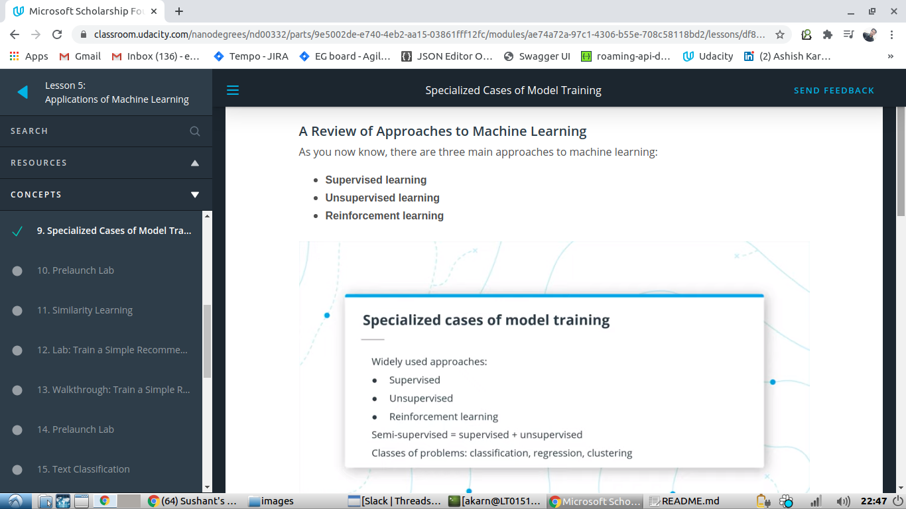
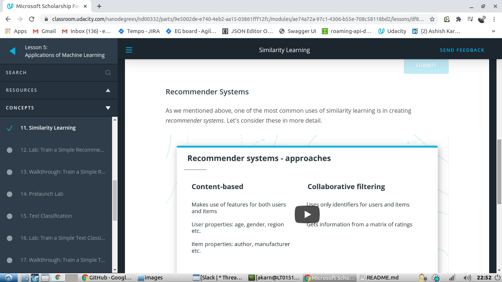
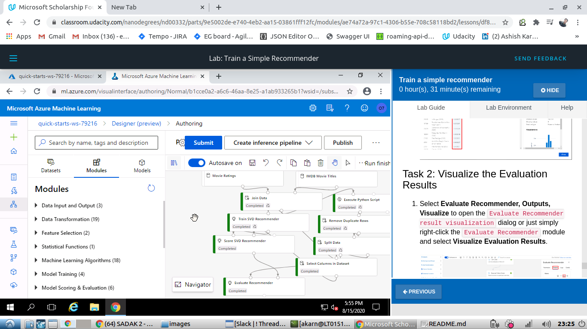
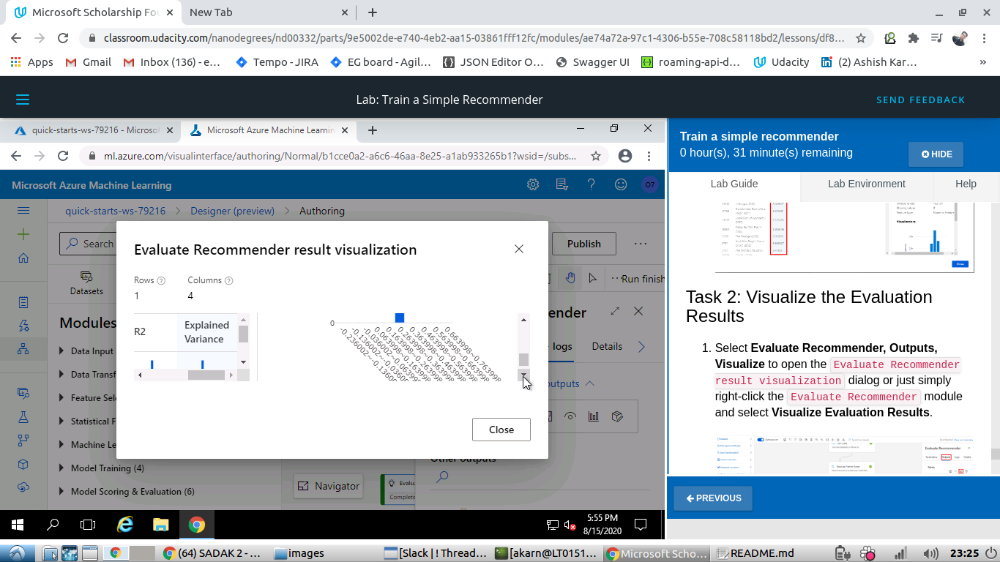


## Day 32: August 14, 2020. #50daysofudacity 
- My current progress is:\
  **1. Introduction to Machine Learning on Azure** (Progress 75%)
    - **Lesson 5. Applications of Machine Learning** (Progress 48%)
		- **Lab: Train a Simple Neural Net**
		- **Walkthrough: Train a Simple Neural Net**
			

I will send good vibes to awesome folks who are doing great  @Tugce @Vanessa Correia @Anok Kumar @Jerry Liao @Iwan Saputra @Godspower Onyenanu @Karthik R @Godspower Onyenanu @Oriji Sandra O. @Jorge @Anela Karamustafic @Sudarshni Sivashankar @Soumi7 @Pasupuleti Chandanato @Kenneth Pham @Seyide Hunyinbo @Shuvro Pal @Vamsi @rafayel @Mike McK @Sebastian Rodriguez @Chris M @Tahreem Arif @Hung @Sabyh @saikat pandit @Zahra Nabila Izdihar and @Kirtika Jaiswal

I will encourage @Vaidehi and @Fatima Correia to continue #50daysofudacity till completion of course.

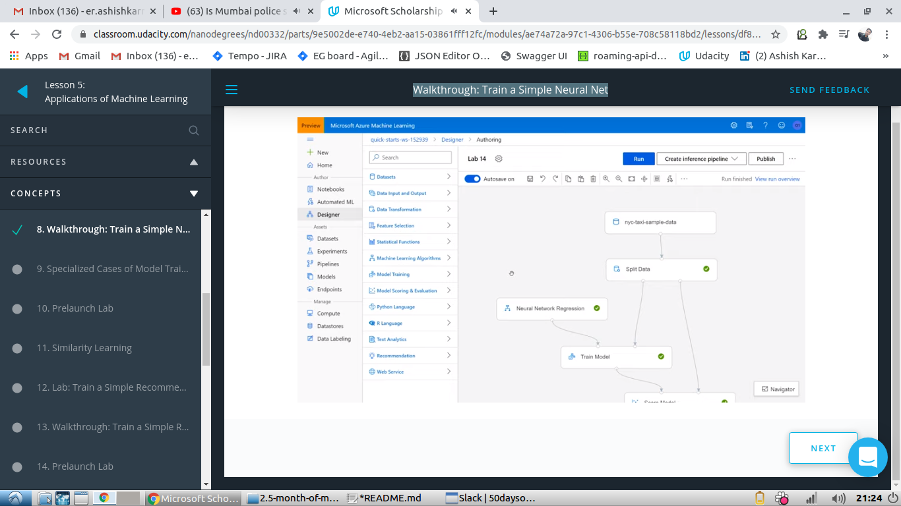
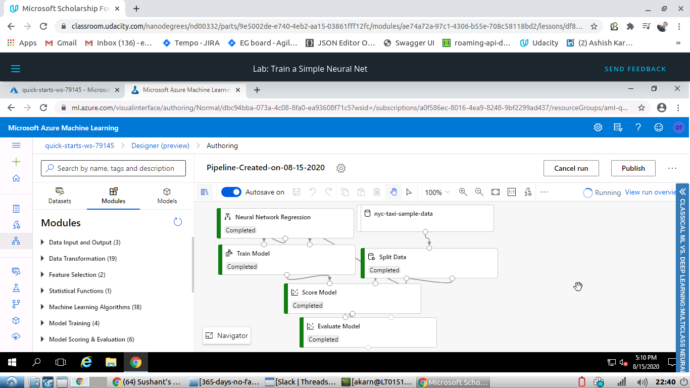
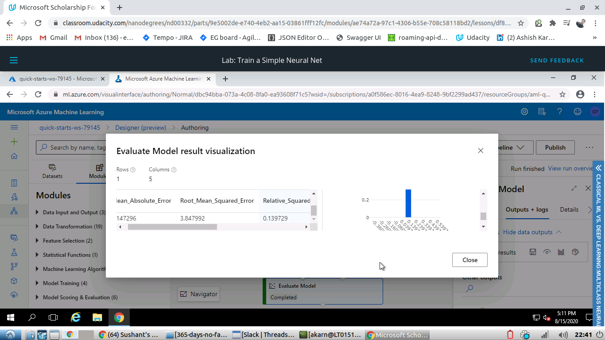


## Day 31: August 13, 2020. #50daysofudacity 
- My current progress is:\
  **1. Introduction to Machine Learning on Azure** (Progress 74%)
    - **Lesson 5. Applications of Machine Learning** (Progress 44%)
		- **Characteristics of Deep Learning**
		- **Benefits and Applications of Deep Learning**
			

I will send good vibes to awesome folks who are doing great @Anok Kumar @Jerry Liao @Iwan Saputra @Godspower Onyenanu @Karthik R @Godspower Onyenanu @Oriji Sandra O. @Jorge @Anela Karamustafic @Sudarshni Sivashankar @Soumi7 @Pasupuleti Chandanato @Kenneth Pham @Seyide Hunyinbo @Shuvro Pal @Vamsi @rafayel @Mike McK @Sebastian Rodriguez @Chris M @Tahreem Arif @Hung @Sabyh @saikat pandit @Zahra Nabila Izdihar and @Kirtika Jaiswal

I will encourage @Tugce and @Vanessa Correia to continue #50daysofudacity till completion of course.

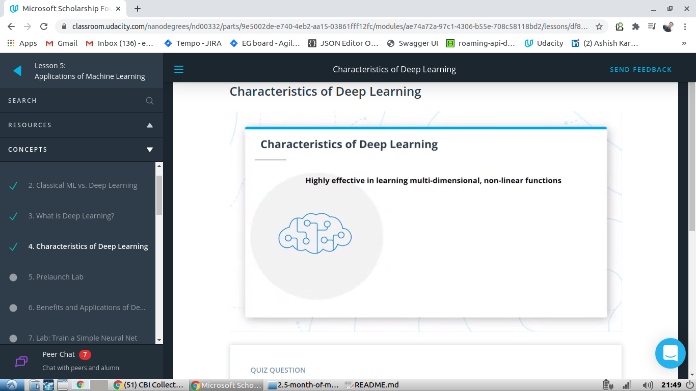
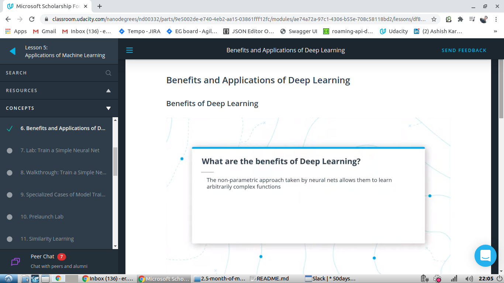


## Day 30: August 12, 2020. #50daysofudacity 
- My current progress is:\
  **1. Introduction to Machine Learning on Azure** (Progress 72%)
    - **Lesson 5. Applications of Machine Learning** (Progress 32%)
		- **Lesson Overview**
		- **Classical Machine Learning vs. Deep Learning**
			
		- **What is Deep learning?**
	
I will send good vibes to awesome folks who are doing great @Jerry Liao @Iwan Saputra @Godspower Onyenanu @Karthik R @Godspower Onyenanu @Oriji Sandra O. @Jorge @Anela Karamustafic @Sudarshni Sivashankar @Soumi7 @Pasupuleti Chandanato @Kenneth Pham @Seyide Hunyinbo @Shuvro Pal @Vamsi @rafayel @Mike McK @Sebastian Rodriguez @Chris M @Tahreem Arif @Hung @Sabyh @saikat pandit @Zahra Nabila Izdihar and @Kirtika Jaiswal

I will encourage @Anok Kumar and @Vanessa Correia to continue #50daysofudacity till completion of course.

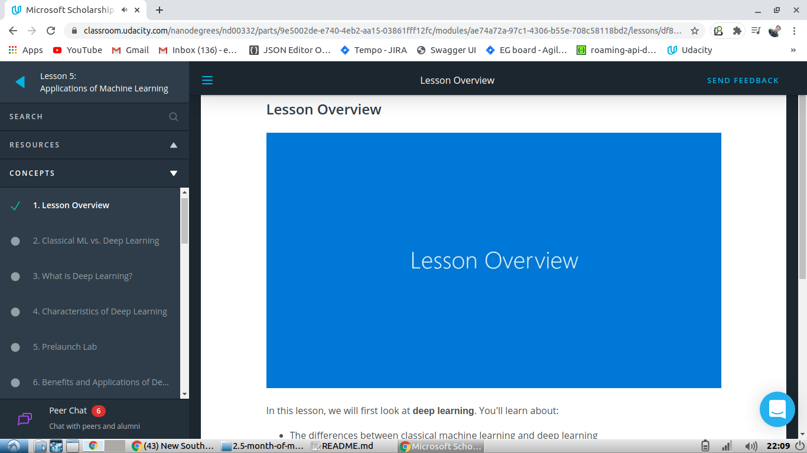
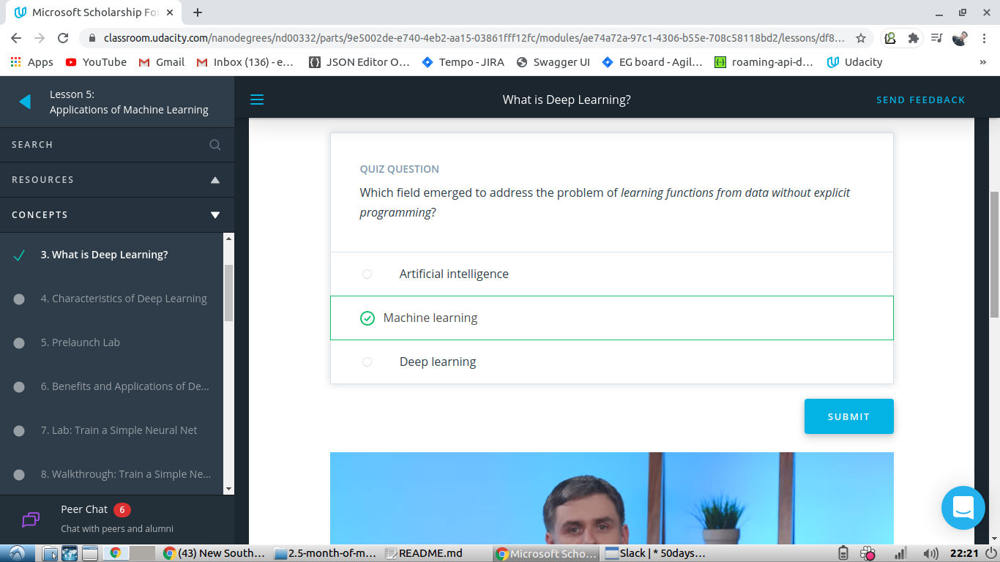


## Day 29: August 11, 2020. #50daysofudacity 
- My current progress is:\
  **1. Introduction to Machine Learning on Azure** (Progress 70%)
    - **Lesson 4. Supervised & Unsupervised learning** (Progress 100%)
		- **Walkthrough: Train a Regressor using Automated ML**
		- **Unsupervised Learning**
		- **Semi-Supervised Learnining**
		- **Clustering**
		- **Lab: Train a Simple Clustering Model**
		- **Walkthrough: Train a Simple Clustering Algorithm**
		- **Lesson Summary**
	
I will send good vibes to awesome folks who are doing great @Godspower Onyenanu @Karthik R @Godspower Onyenanu @Oriji Sandra O. @Jorge @Anela Karamustafic @Sudarshni Sivashankar @Soumi7 @Pasupuleti Chandanato @Kenneth Pham @Seyide Hunyinbo @Shuvro Pal @Vamsi @rafayel @Mike McK @Sebastian Rodriguez @Chris M @Tahreem Arif @Hung @Sabyh @saikat pandit @Zahra Nabila Izdihar and @Kirtika Jaiswal

I will encourage @Jerry Liao and @Iwan Saputra to continue #50daysofudacity till completion of course.

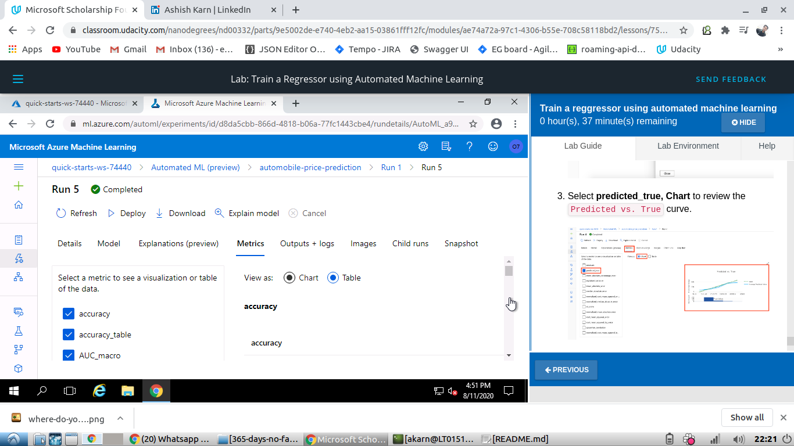
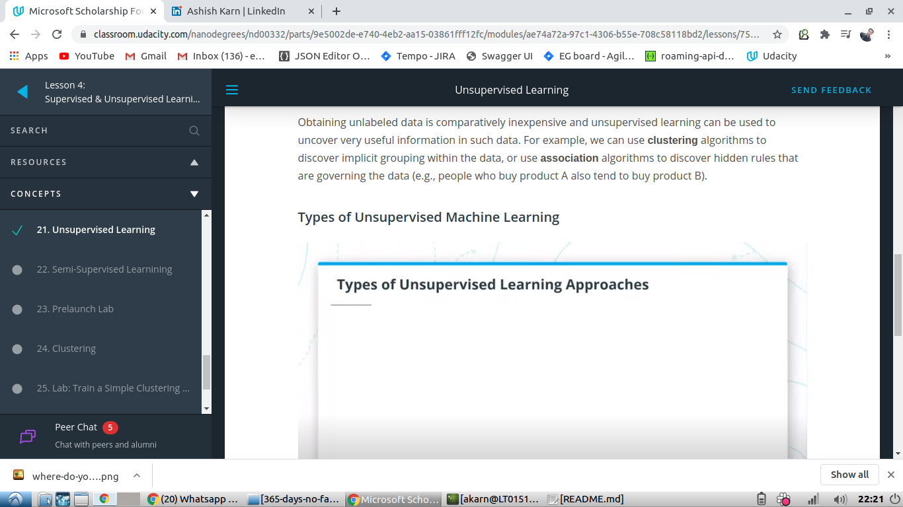

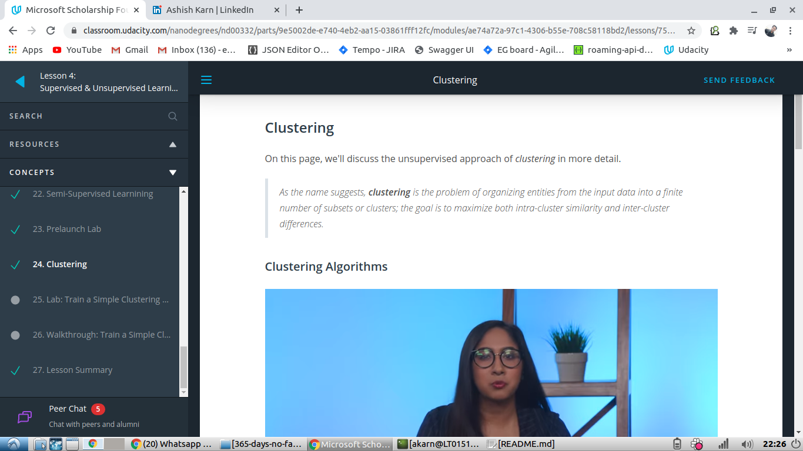
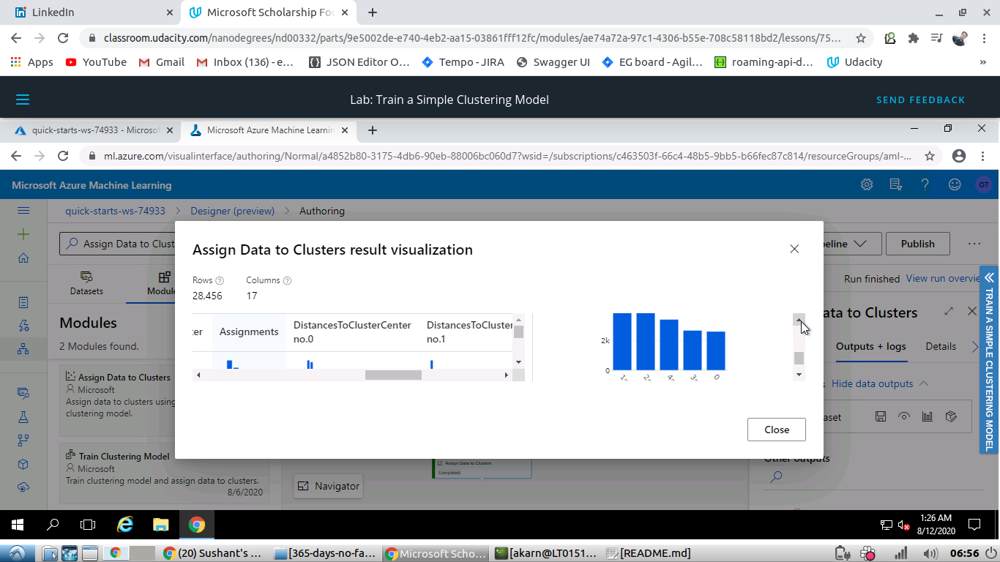
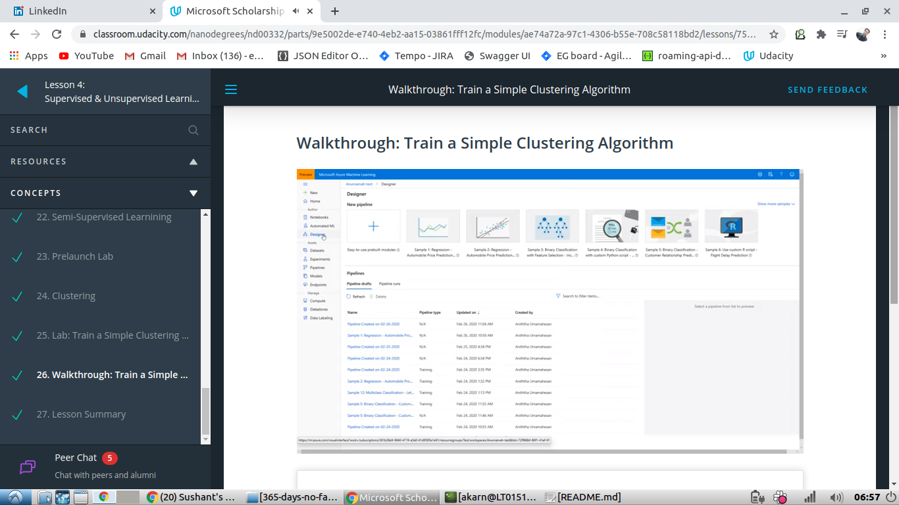


## Day 28: August 10, 2020. #50daysofudacity 
- My current progress is:\
  **1. Introduction to Machine Learning on Azure** (Progress 67%)
    - **Lesson 4. Supervised & Unsupervised learning** (Progress 81%)
		- **Automate the Training of Regressors**
		- **Lab: Train a Regressor using Automated Machine Learning**
	
I will send good vibes to awesome folks who are doing great@Godspower Onyenanu @Oriji Sandra O. @Jorge @Anela Karamustafic @Sudarshni Sivashankar @Soumi7 @Pasupuleti Chandanato @Kenneth Pham @Seyide Hunyinbo @Shuvro Pal @Vamsi @rafayel @Mike McK @Sebastian Rodriguez @Chris M @Tahreem Arif @Hung @Sabyh @saikat pandit @Zahra Nabila Izdihar and @Kirtika Jaiswal

I will encourage @Godspower Onyenanu and @Karthik R to continue #50daysofudacity till completion of course.

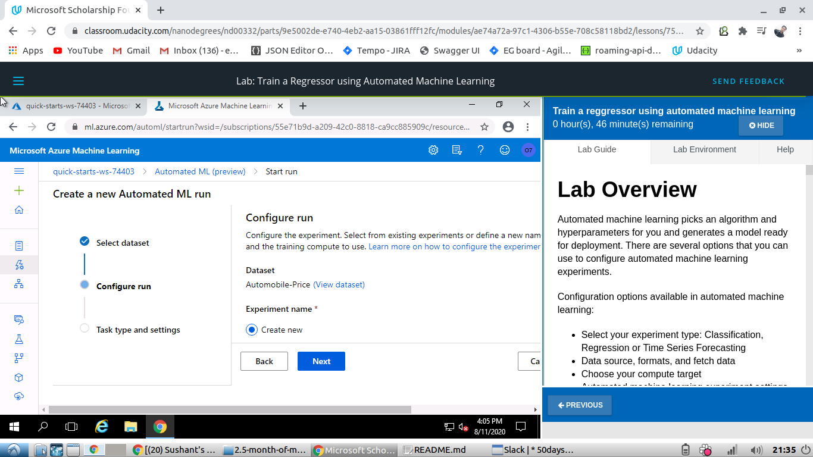


## Day 27: August 9, 2020. #50daysofudacity 
- My current progress is:\
  **1. Introduction to Machine Learning on Azure** (Progress 66%)
    - **Lesson 4. Supervised & Unsupervised learning** (Progress 74%)
		- **Lab: Regressors Performance**
		- **Walkthrough: Regressors Performance**
	
I will send good vibes to awesome folks who are doing great @Jorge @Anela Karamustafic @Sudarshni Sivashankar @Soumi7 @Pasupuleti Chandanato @Kenneth Pham @Seyide Hunyinbo @Shuvro Pal @Vamsi @rafayel @Mike McK @Sebastian Rodriguez @Chris M @Tahreem Arif @Hung @Sabyh @saikat pandit @Zahra Nabila Izdihar and @Kirtika Jaiswal

I will encourage @Pasupuleti Chandana and @Oriji Sandra O. continue #50daysofudacity till completion of course.

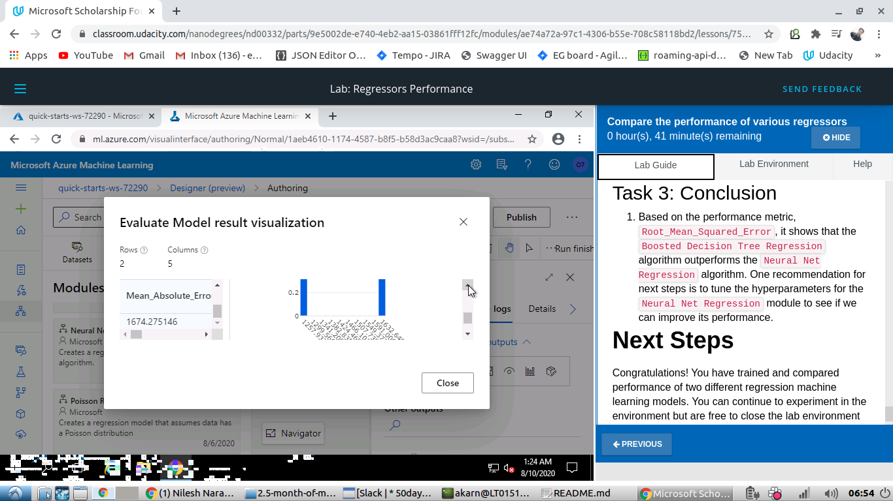
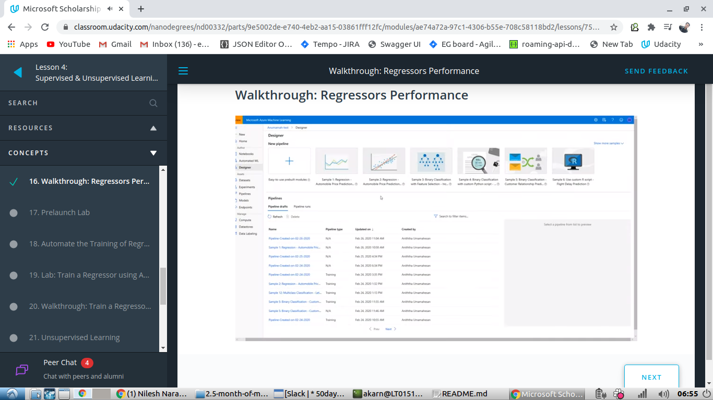


## Day 26: August 8, 2020. #50daysofudacity 
- My current progress is:\
  **1. Introduction to Machine Learning on Azure** (Progress 61%)
    - **Lesson 4. Supervised & Unsupervised learning** (Progress 48%)
		- **Supervised Learning: Regression**
			> In a regression problem, the output is numerical or continuous.
			
			Common types of regression problems include:\
				- **Regression on tabular data:** The data is available in the form of rows and columns, potentially originating from a wide variety of data sources.
				- **Regression on image or sound data:** Training data consists of images/sounds whose numerical scores are already known. Several steps need to be performed during the preparation phase to transform images/sounds into numerical vectors accepted by the algorithms.
				- **Regression on text data:** Training data consists of texts whose numerical scores are already known. Several steps need to be performed during the preparation phase to transform text into numerical vectors accepted by the algorithms.
		- **Categories of Algorithms**	
			Common machine learning algorithms for regression problems include:
			- **Linear Regression**
				- Fast training, linear model
			- **Decision Forest Regression**
				- Accurate, fast training times
			- **Neural Net Regression**
				- Accurate, long training times
	
I will send good vibes to awesome folks who are doing great @Sudarshni Sivashankar @Soumi7 @Pasupuleti Chandanato @Kenneth Pham @Seyide Hunyinbo @Shuvro Pal @Vamsi @rafayel @Mike McK @Sebastian Rodriguez @Chris M @Tahreem Arif @Hung @Sabyh @saikat pandit @Zahra Nabila Izdihar and @Kirtika Jaiswal

I will encourage @Jorge and @Anela Karamustafic continue #50daysofudacity till completion of course.

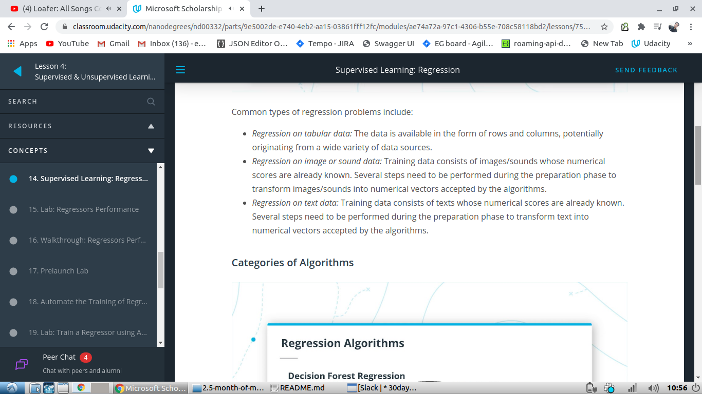
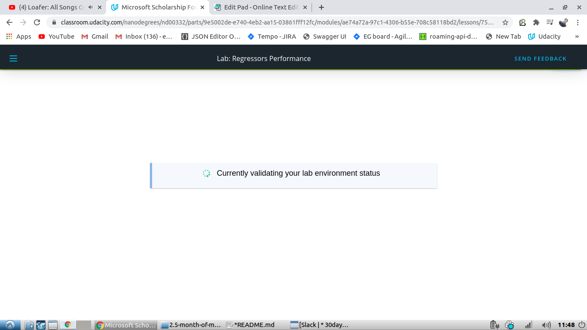


## Day 25: August 7, 2020. #50daysofudacity 
- My current progress is:\
  **1. Introduction to Machine Learning on Azure** (Progress 61%)
    - **Lesson 4. Supervised & Unsupervised learning** (Progress 48%)
		- **Lab: Train a Classifier Using Automated ML** 
		- **Walkthrough: Train a Classifier Using Automated ML**
	
I will send good vibes to awesome folks who are doing great @Pasupuleti Chandanato @Kenneth Pham @Seyide Hunyinbo @Shuvro Pal @Vamsi @rafayel @Mike McK @Sebastian Rodriguez @Chris M @Tahreem Arif @Hung @Sabyh @saikat pandit @Zahra Nabila Izdihar and @Kirtika Jaiswal

I will encourage @Sudarshni Sivashankar and @Soumi7 continue #50daysofudacity till completion of course.

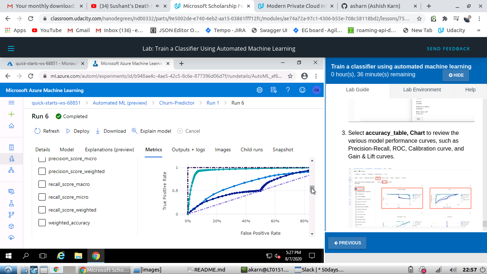
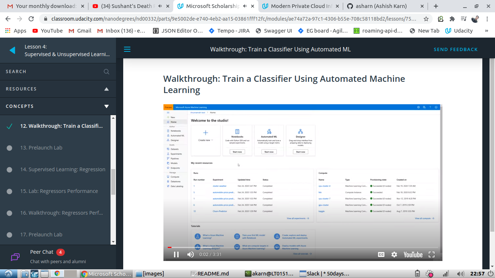


## Day 24: August 6, 2020. #50daysofudacity 
- My current progress is:\
  **1. Introduction to Machine Learning on Azure** (Progress 61%)
    - **Lesson 4. Supervised & Unsupervised learning** (Progress 44%)
		- **Lab: Multi-Class Classifiers Performance** 
		- **Walkthrough: Multi-Class Classifiers Performance**
	
I will send good vibes to awesome folks who are doing great @Pasupuleti Chandanato @Kenneth Pham @Seyide Hunyinbo @Shuvro Pal @Vamsi @rafayel @Mike McK @Sebastian Rodriguez @Chris M @Tahreem Arif @Hung @Sabyh @saikat pandit @Zahra Nabila Izdihar and @Kirtika Jaiswal

I will encourage @Sudarshni Sivashankar and @Soumi7 continue #50daysofudacity till completion of course.

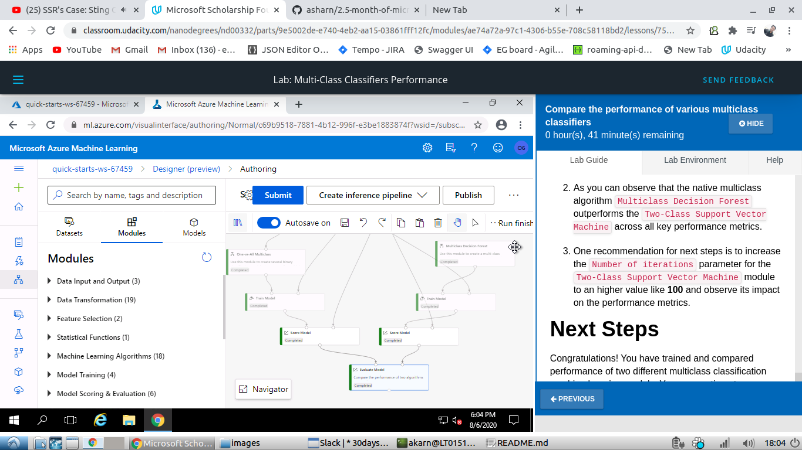
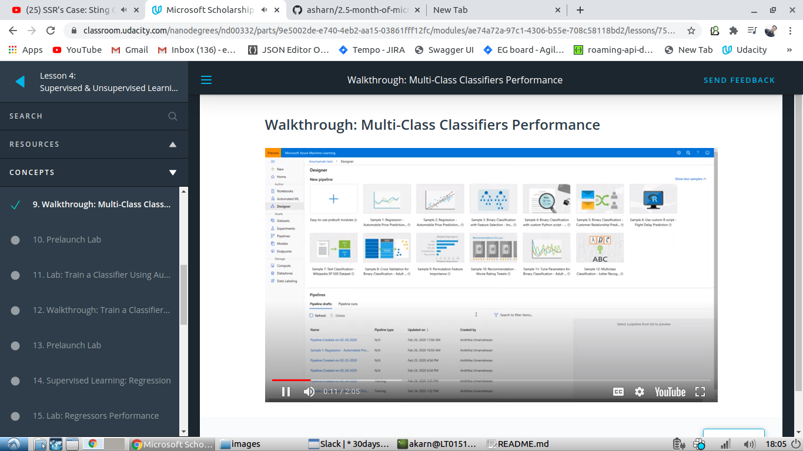


## Day 23: August 5, 2020. #50daysofudacity 
- My current progress is:\
  **1. Introduction to Machine Learning on Azure** (Progress 56%)
    - **Lesson 4. Supervised & Unsupervised learning** (Progress 19%)
		- **Multi-Class Algorithms** 
		- **Lab: Multi-Class Classifiers Performance**
	
I will send good vibes to awesome folks who are doing great @Seyide Hunyinbo @Shuvro Pal @Vamsi @rafayel @Mike McK @Sebastian Rodriguez @Chris M @Tahreem Arif @Hung @Sabyh @saikat pandit @Zahra Nabila Izdihar and @Kirtika Jaiswal

I will encourage @Pasupuleti Chandanato and @Kenneth Pham continue #50daysofudacity till completion of course.

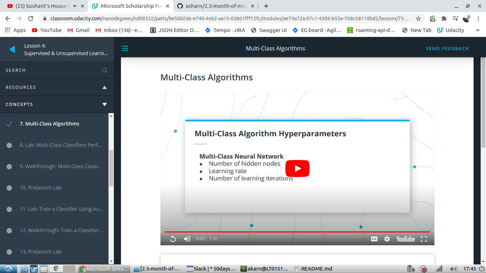


## Day 22: August 4, 2020. #50daysofudacity 
- My current progress is:\
  **1. Introduction to Machine Learning on Azure** (Progress 56%)
    - **Lesson 4. Supervised & Unsupervised learning** (Progress 19%)
		- **Lab: Two-Class Classifiers Performance** 
		- **Prelaunch Lab**
	
I will send good vibes to awesome folks who are doing great @Vamsi @rafayel @Mike McK @Sebastian Rodriguez @Chris M @Tahreem Arif @Hung @Sabyh @saikat pandit @Zahra Nabila Izdihar and @Kirtika Jaiswal

I will encourage  @Seyide Hunyinbo and @Shuvro Pal to continue #50daysofudacity till completion of course.

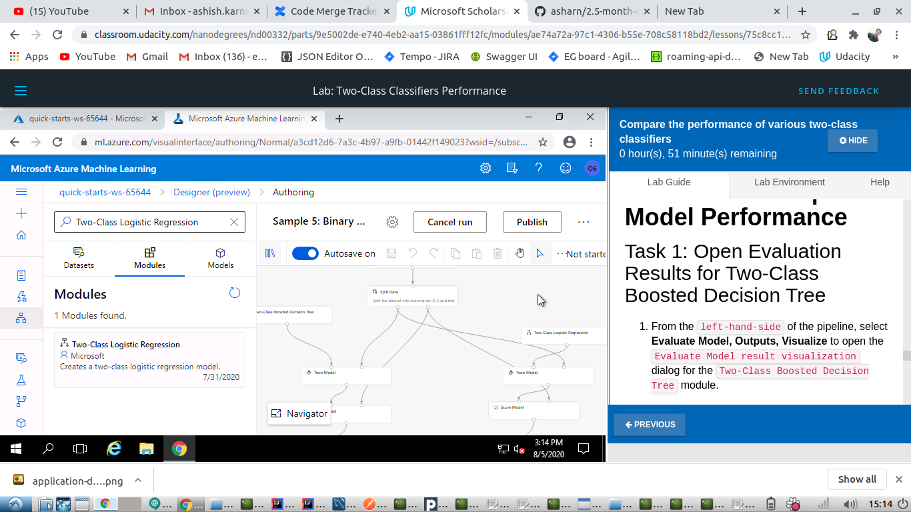


## Day 21: August 3, 2020. #50daysofudacity 
- My current progress is:\
  **1. Introduction to Machine Learning on Azure** (Progress 56%)
    - **Lesson 4. Supervised & Unsupervised learning** (Progress 19%)
		- **Lesson Overview** 
			First, we'll cover **supervised learning**. Specifically, we'll learn:
			- More about classification and regression, two of the most representative supervised learning tasks
			- Some of the major algorithms involved in supervised learning, as well as how to evaluate and compare their performance
			- How to use automated machine learning to automate the training and selection of classifiers and regressors, and how to use the Designer in Azure Machine Learning Studio to create automated Machine Learning experiments
			
			Next, the lesson will focus on **unsupervised learning**, including:
			- Its most representative learning task, clustering
			- How unsupervised learning can address challenges like lack of labeled data, the curse of dimensionality, overfitting, feature engineering, and outliers
			- An introduction to representation learning
			- How to train your first clustering model in Azure Machine Learning Studio
		- **Prelaunch Lab**
		- **Supervised Learning: Classification**
			> In a classification problem, the outputs are categorical or discrete.

			Some of the most common types of classification problems include:
			- Classification on tabular data: The data is available in the form of rows and columns, potentially originating from a wide variety of data sources.
			- Classification on image or sound data: The training data consists of images or sounds whose categories are already known.
			- Classification on text data: The training data consists of texts whose categories are already known.
	
	
I will send good vibes to awesome folks who are doing great  @Mike McK @Sebastian Rodriguez @Chris M @Tahreem Arif @Hung @Sabyh @saikat pandit @Zahra Nabila Izdihar and @Kirtika Jaiswal

I will encourage  @Vamsi  and @rafayel to continue #50daysofudacity till completion of course.

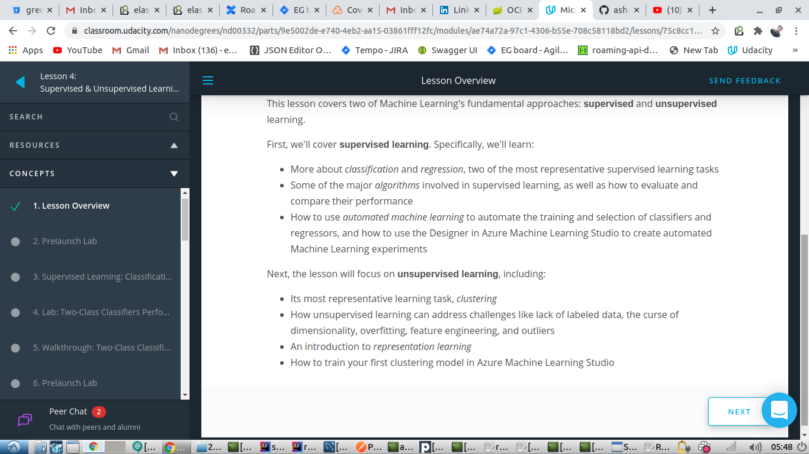
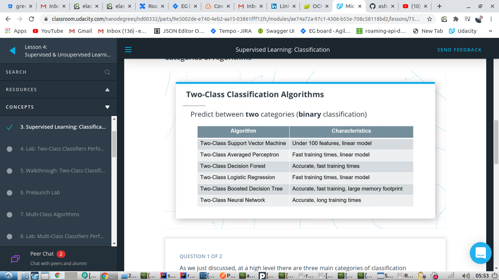


## Day 20: August 2, 2020. #50daysofudacity 
- My current progress is:\
  **1. Introduction to Machine Learning on Azure** (Progress 54%)
    - **Lesson 3. Model Training** (Progress 100%)
		- **Lab: Train a Simple Classifier with Automated ML** completed.
		- **Walkthrough: Train a Simple Classifier with Automated ML**
		- **Lesson Summary**
	
	
I will send good vibes to awesome folks who are doing great @Chris M @Tahreem Arif @Hung @Sabyh @Jaime Alejandro Parra Parra @saikat pandit @Zahra Nabila Izdihar and @Kirtika Jaiswal

I will encourage @Mike Supelano @Sebastian Romero @Dishant Tanwar and @Autumn to continue #50daysofudacity till completion of course.

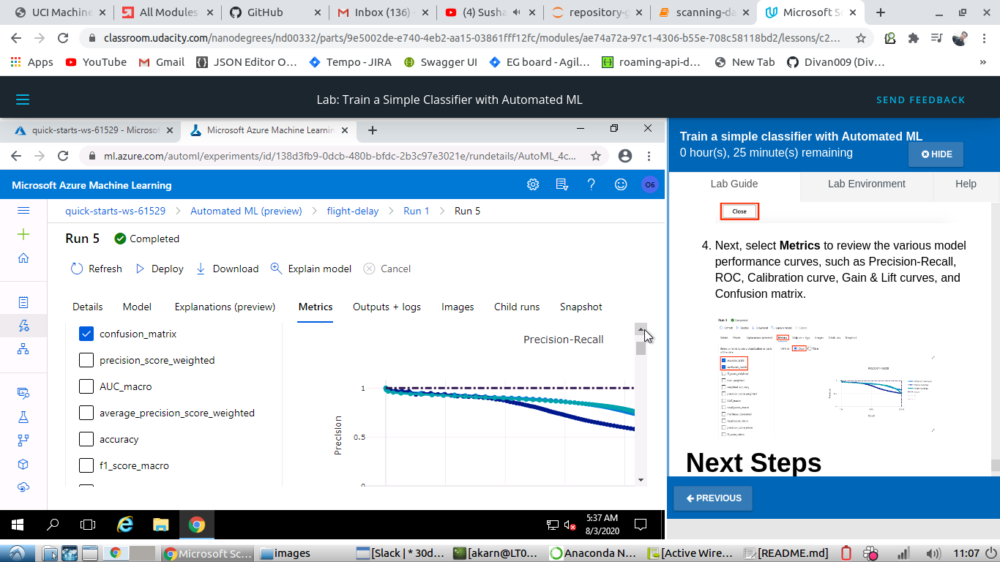
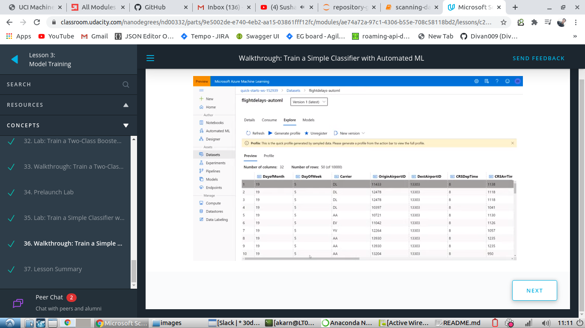
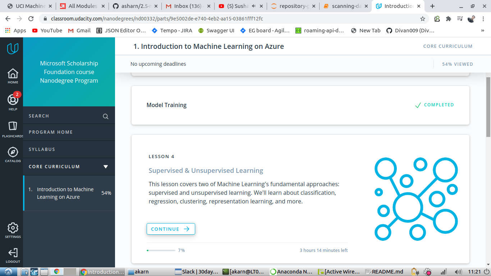


To complete one lab task it takes almost 3 hours which can be done within 15 min. Microsoft services are very bad, slow and disturbing functionality.
## Day 19: August 1, 2020. #50daysofudacity 
- My current progress is:\
  **1. Introduction to Machine Learning on Azure** (Progress 54%)
    - **Lesson 3. Model Training** (Progress 97%)
		- **Lab: Train and Evaluate a Model** completed.
		- **Walkthrough: Train a Two-Class Boosted Decision Tree**
	
	
I will send good vibes to awesome folks who are doing great @Chris M @Tahreem Arif @Hung @Sabyh @saikat pandit 

I will encourage @Zahra Nabila Izdihar and @Kirtika Jaiswal to continue #50daysofudacity till completion of course.

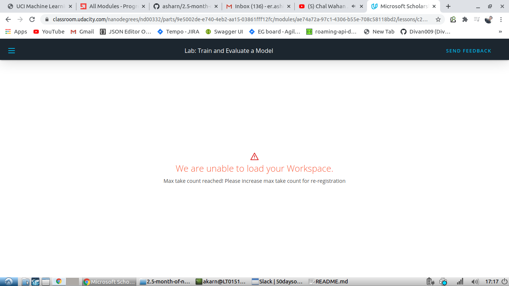
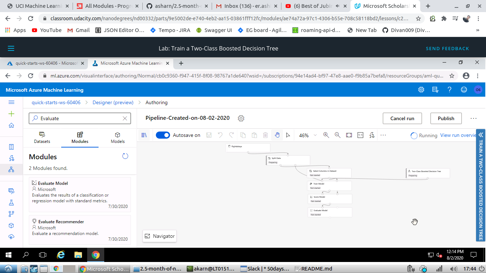
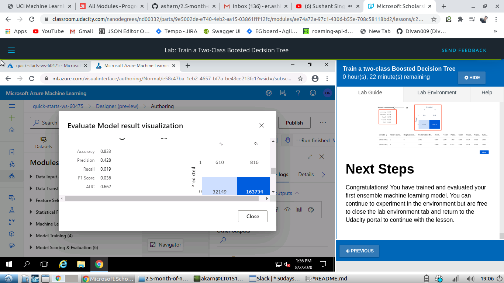


## Day 18: July 31, 2020. #50daysofudacity
- My current progress is:\
  **1. Introduction to Machine Learning on Azure** (Progress 52%)
    - **Lesson 3. Model Training** (Progress 89%)
		- **Lab: Train and Evaluate a Model**
	
	
I will encourage awesome folks who help me to solve my problem @Shikhar Chhabra @Prasanth Nair @Zoé Goey @M Thejaswini


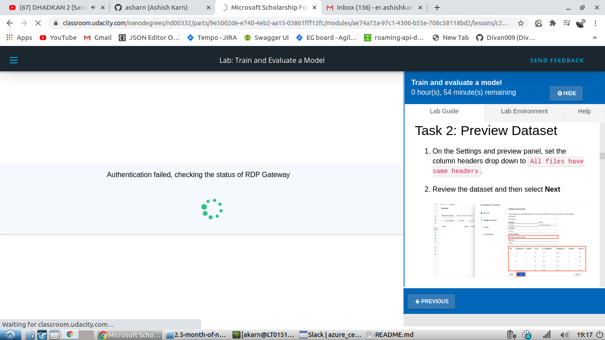
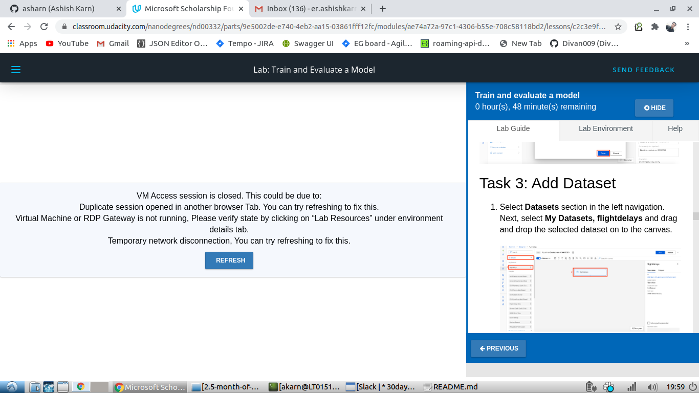


## Day 17: July 30, 2020. #50daysofudacity
- My current progress is:\
  **1. Introduction to Machine Learning on Azure** (Progress 52%)
    - **Lesson 3. Model Training** (Progress 89%)
		- **Walkthrough: Train and Evaluate a Model**
		- **Prelaunch Lab**
		- **Strength in Numbers**
	
	
I will encourage some random folk @Akshay mahale @Ram @Anjali Poornima  @Jayavardhan Kaspa  @Archita Totla 
													@Melody Pereira @Jahnavi Jonnalagadda @Shivani Chauhan @Abiola Omolaja
													@Arpita Gupta @Harkirat Singh @Preeti Sharma @VU Anh-Tuan @Bhavya Dubey 


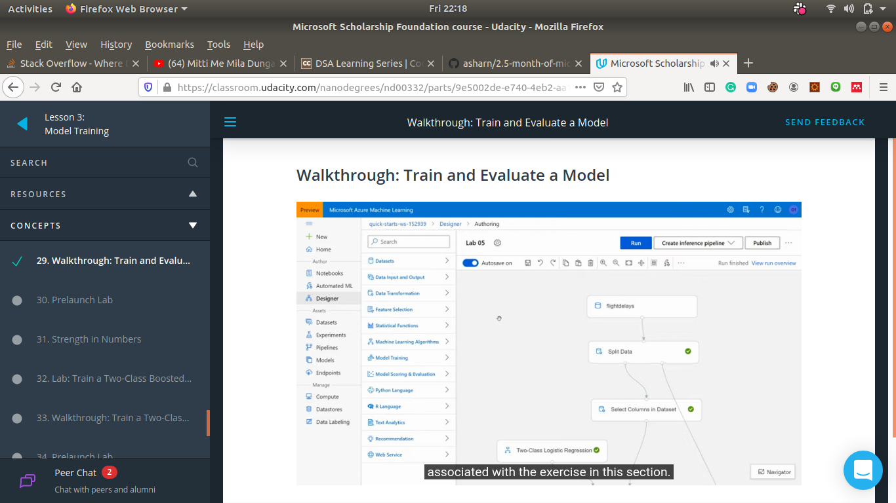
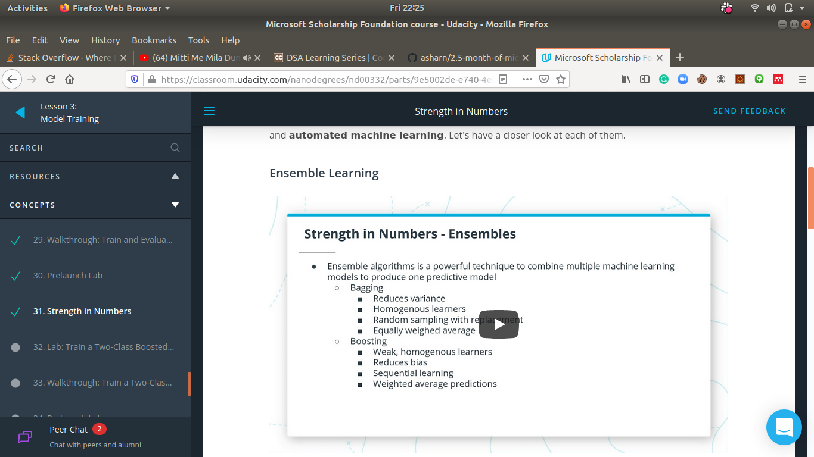


## Day 16: July 29, 2020. #50daysofudacity
- My current progress is:\
  **1. Introduction to Machine Learning on Azure** (Progress 49%)
    - **Lesson 3. Model Training** (Progress 78%)
		- **Lab: Train and Evaluate a Model**
	
	
I will encourage some random folk @Gerry K @Jason Yoo @Karol Karwat  @Jayavardhan Kaspa  @Archita Totla 
													@Melody Pereira @Jahnavi Jonnalagadda @Shivani Chauhan @Abiola Omolaja
													@Arpita Gupta @Harkirat Singh @Preeti Sharma @VU Anh-Tuan @Bhavya Dubey 


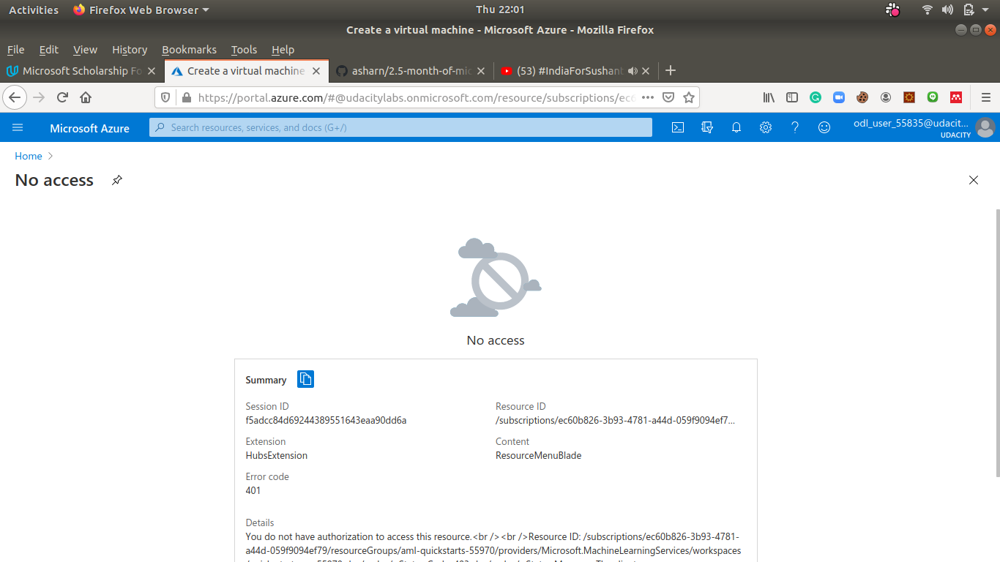


## Day 15: July 28, 2020. #50daysofudacity
- My current progress is:\
  **1. Introduction to Machine Learning on Azure** (Progress 49%)
    - **Lesson 3. Model Training** (Progress 78%)
		- **Confusion Matrices**
		![Confusion Matrices][confusion-matrix.png]
		- **Evaluation Metrics for Classification**
		- **Evaluation Metrics for Regression**


I will encourage some random folk @Gerry K @Jason Yoo @Karol Karwat  @Jayavardhan Kaspa  @Archita Totla 
													@Melody Pereira @Jahnavi Jonnalagadda @Shivani Chauhan @Abiola Omolaja
													@Arpita Gupta @Harkirat Singh @Preeti Sharma @VU Anh-Tuan @Bhavya Dubey 


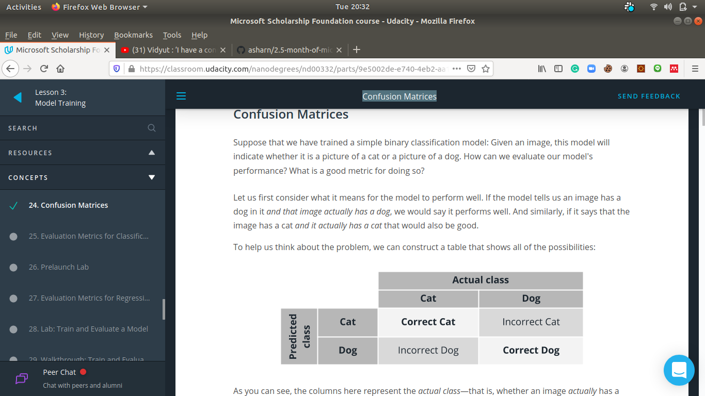
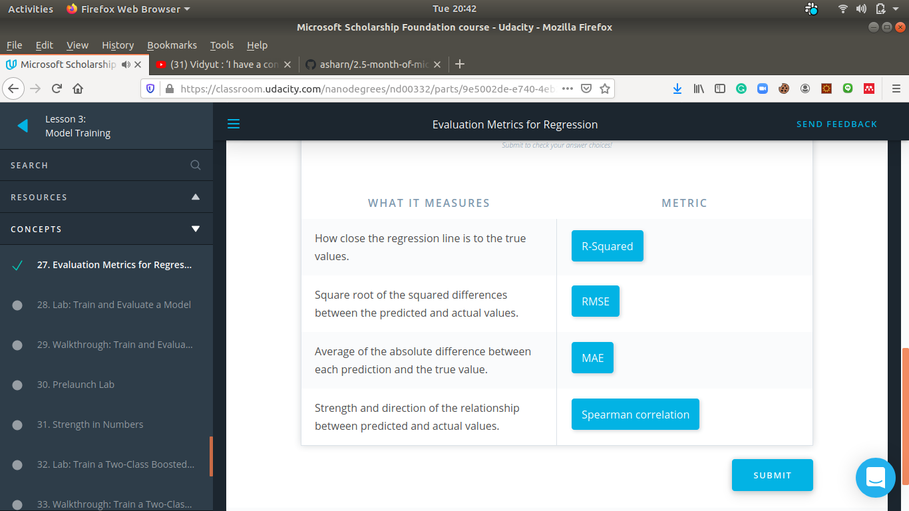


## Day 14: July 27, 2020. #50daysofudacity
- My current progress is:\
  **1. Introduction to Machine Learning on Azure** (Progress 46%)
    - **Lesson 3. Model Training** (Progress 69%)
		- **Training Classifiers**
			>  In a **classification** problem, the outputs are categorical or discrete.
		- **Training Regressors**
			> In a **regression** problem, the output is numerical or continuous.
		- **Evaluating Model Performance**
			> The **test dataset** is a portion of labeled data that is split off and reserved for model evaluation.


I will encourage some random folk @Gerry K @Jason Yoo @Karol Karwat  @Jayavardhan Kaspa  @Archita Totla 
													@Melody Pereira @Jahnavi Jonnalagadda @Shivani Chauhan @Abiola Omolaja


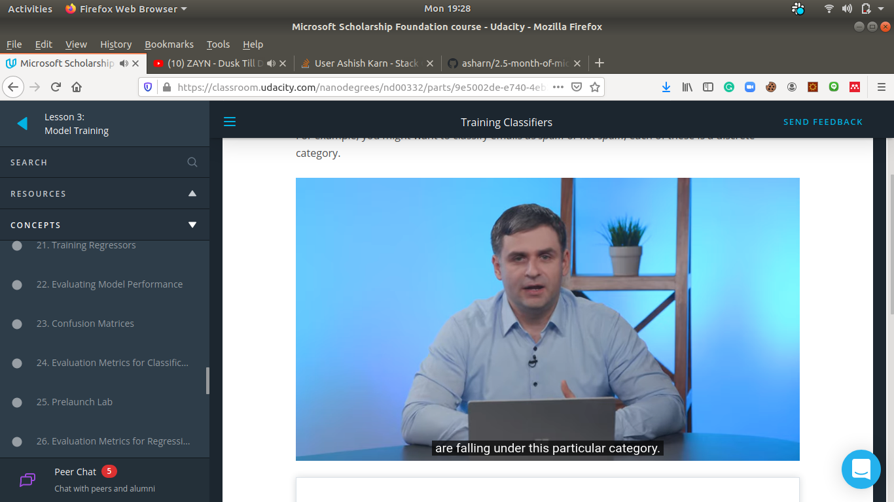
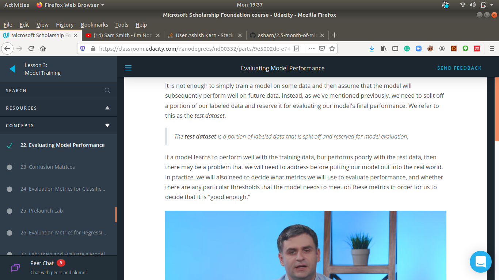


## Day 13: July 26, 2020. #50daysofudacity
- My current progress is:\
  **1. Introduction to Machine Learning on Azure** (Progress 44%)
    - **Lesson 3. Model Training** (Progress 61%)
		- **Data Drift**
		- **Model Training Basics**
		- **Model Training in Azure Machine Learning**


I will encourage some random folk @Anindam Som @Jason Yoo @Shrutika Aggarwal @Meerzhan @mars
													@Melody Pereira @Jahnavi Jonnalagadda @Shivani Chauhan @Michelle Foo


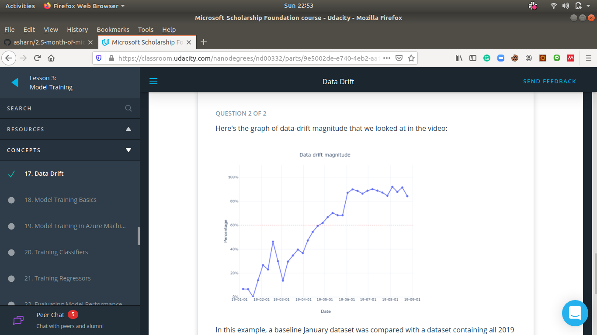
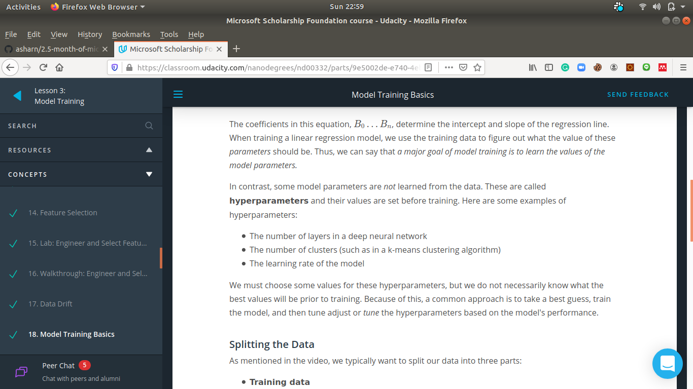


## Day 12: July 25, 2020. #50DaysofUdacity
- My current progress is:\
  **1. Introduction to Machine Learning on Azure** (Progress 43%)
    - **Lesson 3. Model Training** (Progress 53%)
		- **Feature Selection**
		- **Lab: Engineer and Select Features**
		- **Walkthrough: Engineer and Select Features**


I will encourage some random folk @Anindam Som @Jason Yoo @Shrutika Aggarwal @Meerzhan @mars


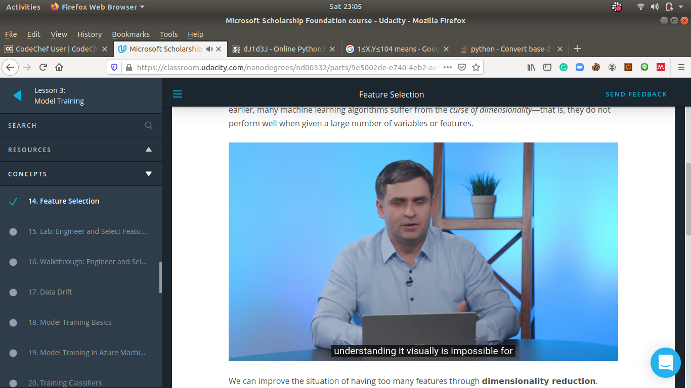
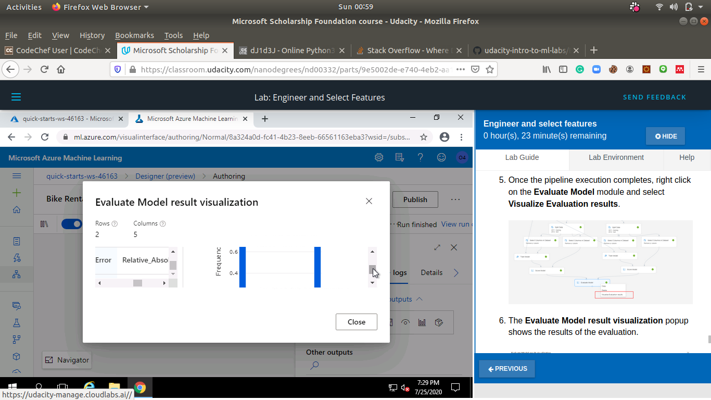


## Day 11: July 24, 2020. #50DaysofUdacity
- My current progress is:\
  **1. Introduction to Machine Learning on Azure** (Progress 41%)
    - **Lesson 3. Model Training** (Progress 42%)
		- **Introducing Features**
		- **Feature Engineering**


I will encourage some random folk @Kuldeep Kumar @Anshu Trivedi @fnando1995 @ChandraShekhar @Deep Chatterjee 
												   @Somya Dwivedi @Solomon Kamau @Mahesh Cheetirala @KT.Yap @ichrak romdhani
												   @Richa @Reza Dwi Utomo @Wooil Jeong @Wojtek Czuba  @Debalekha Chakraborty 
												    @Atul @Clarisse Simoes Ribeiro @Daniela Alexandra Galindo Maldonado @Abita Ann Augustine
													@manas @Rafa Banzo @SHASHANK KUMAR, @Surya @Annalisa @Oluseun Olulana @AudreyST @Rene


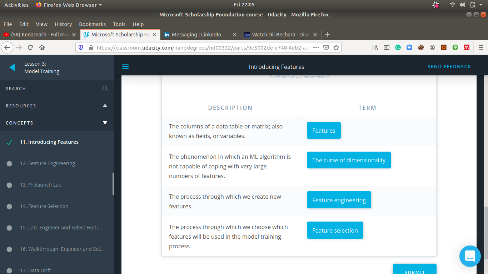


## Day 10: July 23, 2020. #50DaysofUdacity
- My current progress is:\
  **1. Introduction to Machine Learning on Azure** (Progress 39%)
    - **Lesson 3. Model Training** (Progress 36%)
		- **Lab: Import, Transform, and Export Data**
		- **Walkthrough: Import, Transform, and Export Data**
		- **Lab: Create and Version a Dataset**
		- **Walkthrough: Create and Version a Dataset**


I will encourage some random folk @Kuldeep Kumar @Anshu Trivedi @fnando1995 @ChandraShekhar VA @Deep Chatterjee 
												   @EO4Wellness @Somya Dwivedi @Solomon Kamau @Mahesh Cheetirala @KT.Yap 
												   @Richa @Reza Dwi Utomo @Wooil Jeong @Wojtek Czuba  @Debalekha Chakraborty 
												   @ichrak romdhani @Atul @Clarisse Simoes Ribeiro @Daniela Alexandra Galindo Maldonado


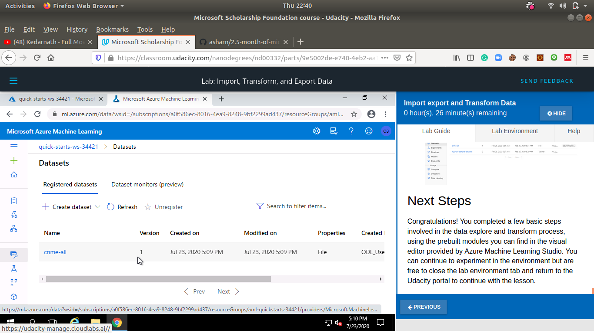


## Day 9: July 22, 2020. #50DaysofUdacity
- My current progress is:\
  **1. Introduction to Machine Learning on Azure** (Progress 38%)
    - **Lesson 3. Model Training** (Progress 31%)
		- **Walkthrough: Import, Transform, and Export Data**
		- **Managing Data**
		- **More About Datasets**


I will encourage some random folk @Kuldeep Kumar @Anshu Trivedi @fnando1995 @ChandraShekhar VA @Deep Chatterjee 
												   @EO4Wellness @Somya Dwivedi @Solomon Kamau @Mahesh Cheetirala @KT.Yap 
												   @Richa @Reza Dwi Utomo @Wooil Jeong @Wojtek Czuba  @Debalekha Chakraborty 


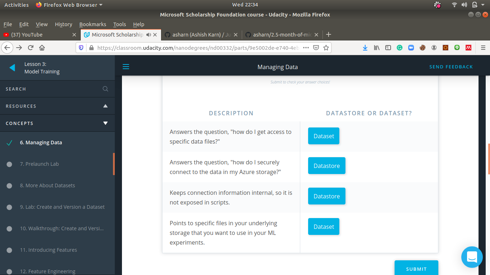


## Day 8: July 21, 2020. #50DaysofUdacity
- My current progress is:\
  **1. Introduction to Machine Learning on Azure** (Progress 35%)
    - **Lesson 3. Model Training** (Progress 17%)
		- **Lab: Import, Transform, and Export Data**
			All exercise completed completed for this lab.

I will encourage some random folk @Kuldeep Kumar @Anshu Trivedi @fnando1995 @ChandraShekhar VA @Deep Chatterjee @EO4Wellness @Somya Dwivedi @Solomon Kamau @Mahesh Cheetirala @KT.Yap 


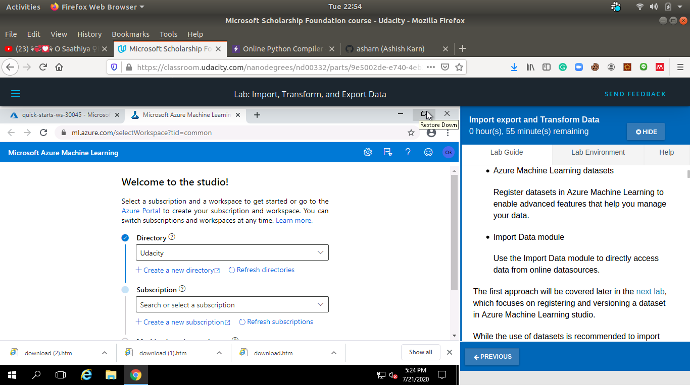

## Day 7: July 20, 2020. #50DaysofUdacity
- My current progress is:\
  **1. Introduction to Machine Learning on Azure** (Progress 35%)
    - **Lesson 3. Model Training** (Progress 17%)
		- **Data Import and Transformation**
		- **Lab: Import, Transform, and Export Data**

I will encourage some random folk @Kuldeep Kumar @Anshu Trivedi @fnando1995 @ChandraShekhar VA @Deep Chatterjee @EO4Wellness @Somya Dwivedi @Solomon Kamau @Mahesh Cheetirala @KT.Yap 


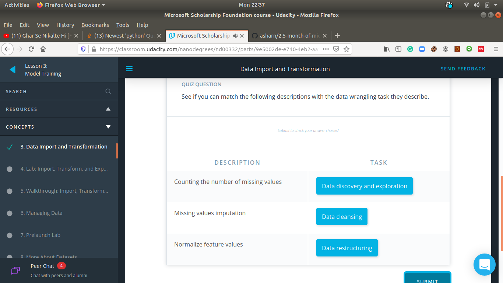


## Day 6: July 19, 2020. #50DaysofUdacity
- My current progress is:\
  **1. Introduction to Machine Learning on Azure** (Progress 34%)
    - **Lesson 2. Introduction to Machine Learning** (Progress 100%)
		- **Approaches to Machine Learning**
			- **Supervised learning**
			- **Unsupervised learning**
			- **Reinforcement learning**
		- **The Trade-Offs**
		```prediction error = Bias error + variance + error + irreducible error```

I will encourage some random folk @Kuldeep Kumar @Anshu Trivedi @fnando1995 @ChandraShekhar VA @Deep Chatterjee @EO4Wellness

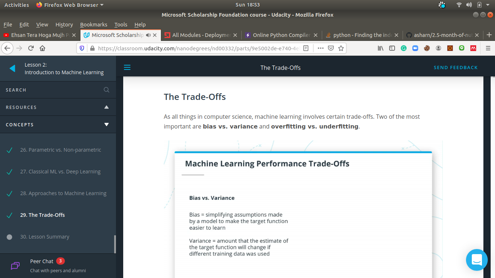


## Day 5: July 18, 2020. #50DaysofUdacity
- My current progress is:\
  **1. Introduction to Machine Learning on Azure** (Progress 11%)
    - **Lesson 2. Introduction to Machine Learning** (Progress 33%)
		- **Encoding Categorical Data**
			- Ordinal Encoding 
			- One hot Encoding.
		- **Image Data**
		- **Text Data**
			- Normalization: Text normalization is the process of transforming a piece of text into a canonical (official) form.
				Lemmatization is an example of normalization .
				Stop words are high-frequency words that are unnecessary (or unwanted) during the analysis.
			- Vectorization: Process of creating simply an array of numbers/texts.
			- Feature Extraction
		- **Two Perspectives on ML**
			- Computer Science Perspectives
			We are using input features to create a program that can generate the desired output.
			- Statistical Perspective
			We are trying to find a mathematical function that, given the values of the independent variables can predict the values of the dependent variables.
		- **The Tools for Machine Learning**
		- **Libraries**
		- **Cloud Services**
			Models are the specific representations learned from data
			Algorithms are the processes of learning
				Model=Algorithm(Data)
		- **Models vs Algorithms**
		- **Linear Regression**
			The Cost Function
		- **Classical ML vs. Deep Learning**

I will encourage some random folk @Kuldeep Kumar @Anshu Trivedi @fnando1995 @ChandraShekhar VA @Deep Chatterjee @EO4Wellness


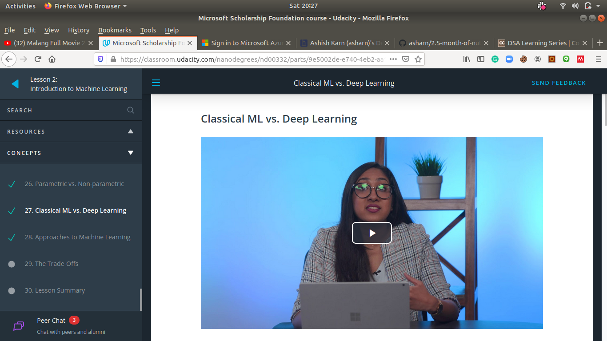


## Day 4: July 17, 2020. #50DaysofUdacity
- My current progress is:\
  **1. Introduction to Machine Learning on Azure** (Progress 11%)
    - **Lesson 2. Introduction to Machine Learning** (Progress 33%)
		- **Tabular Data**
		In machine learning, the most common type of data you'll encounter is tabular data—that is, data that is arranged in a data table.
		- **Scaling Data**
		Scaling data means transforming it so that the values fit within some range or scale, such as 0–100 or 0–1. There are a number of reasons why it is a good idea to scale your data before feeding it into a machine learning algorithm.

I will encourage @Bakhytdariya @Lilly T @Ozan Ersoy @Saswata Rakshit @priyanka Prasad @Vanshika Mediratta 
						@Habeeb Kazeem @Mayowa Omotunde  @Gunreet Kaur @Abhra Debroy @Ohikhatemen George @Lethabo @Richard Reader
						@Sagar Jangid  @Jee Gikera @sripathi @Omar Ayman


## Day 3: July 16, 2020. #50DaysofUdacity
- My current progress is:\
  **1. Introduction to Machine Learning on Azure** (Progress 9%)
    - **Lesson 2. Introduction to Machine Learning** (Progress 23%)
		- **The Data Science Process**
		- **Common Types of Data**
		**It's All Numerical in the End**

I will encourage @Bakhytdariya @Lilly T @Ozan Ersoy @Saswata Rakshit @priyanka Prasad @Vanshika Mediratta 
						@Habeeb Kazeem


## Day 2: July 15, 2020. #50DaysofUdacity
- My current progress is:\
  **1. Introduction to Machine Learning on Azure** (Progress 8%)
    - **Lesson 2. Introduction to Machine Learning** (Progress 17%)
		- **Applications of Machine Learning**
		- **Brief History of Machine Learning**
		- **What’s the Difference Between Artificial Intelligence, Machine Learning and Deep Learning? by Michael Copeland at NVIDIA**				

I will encourage @Bakhytdariya @Lilly T @Ozan Ersoy @Saswata Rakshit @priyanka Prasad @Vanshika Mediratta 
						@Habeeb Kazeem


Here are the main topics that will be covered:

- What machine learning is and why it's so important in today's world
- The historical context of machine learning
- The data science process
- The types of data that machine learning deals with
- The two main perspectives in ML: the statistical perspective and the computer science perspective
- The essential tools needed for designing and training machine learning models
- The basics of Azure ML
- The distinction between models and algorithms
- The basics of a linear regression model
- The distinction between parametric vs. non-parametric functions
- The distinction between classical machine learning vs. deep learning
- The main approaches to machine learning
- The trade-offs that come up when making decisions about how to design and training machine learning models


## Day 1: July 14, 2020. #50DaysofUdacity
- My current progress is:\
  **1. Introduction to Machine Learning on Azure** (Progress 6%)
    - **Lesson 2. Introduction to Machine Learning** (Progress 7%)
		- **Lesson Overview**
		- **What is Machine Learning?**


